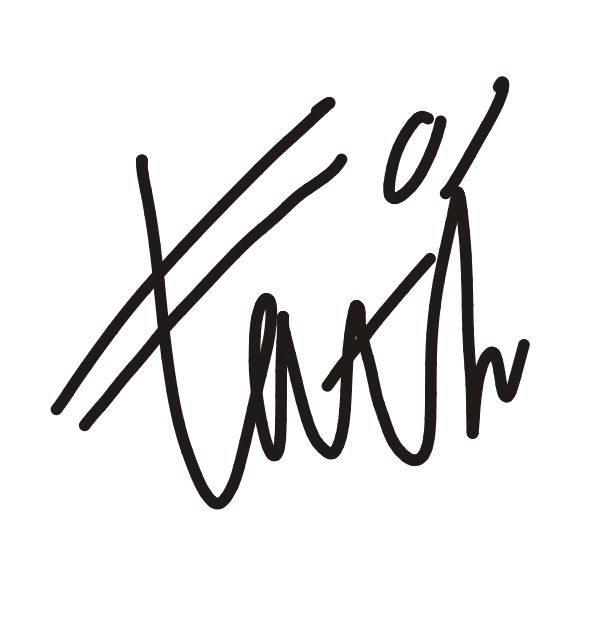
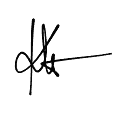
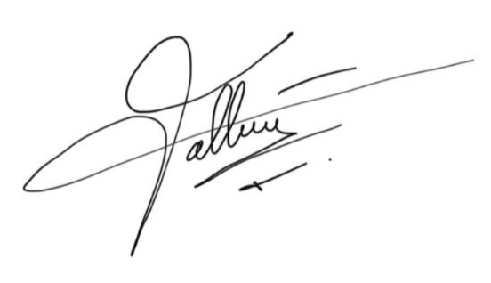
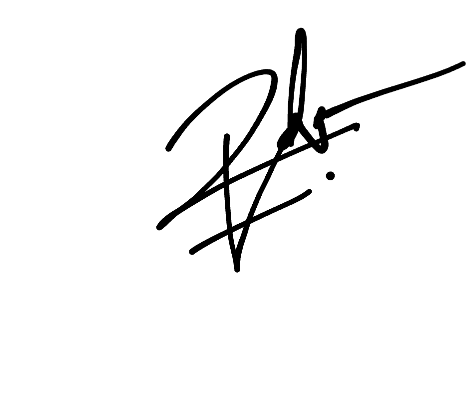

# Deklarasi Penggunaan AI

## Tugas Besar IF2150 - Rekayasa Perangkat Lunak

| Informasi | Keterangan |
|---|---|
| Kelas | *K02* |
| Nomor Kelompok | *07* |
| Nama Kelompok | *RaPeL* |
| Nama Perangkat Lunak | *Pross* |

**Anggota Kelompok:**

| NIM | Nama |
|---|---|
| *13525002* | *Ahmad Boutros Fathir* |
| *13525020* | *Klio Lysander* |
| *13525047* | *Muhammad Fakhriyan Rizki M.* |
| *13525053* | *Kevin Sie* |
| *13525062* | *Rafel Dzinun Muhammad* |

---

### Daftar Isi
* [Milestone 1](#milestone-1)

---

### Log Penggunaan AI per Milestone

### Milestone 1
| Tool AI | Tujuan Penggunaan | Contoh Prompt Utama | Modifikasi & Validasi Manusia |
| :--- | :--- | :--- | :--- |
| *Claude* | *Mencari Brainstorming Ide Masalah* | *"Apa contoh masalah yang berkaitan dengan SDG 8?"* | *AI menyarankan tentang masalah UMKM dan kami menyetejuinya serta mengerucutkan masalah menjadi lebih inti.* |
| | | | | |

---
### Pernyataan Integritas dan Persetujuan

Kami yang bertanda tangan di bawah ini menyatakan bahwa seluruh log penggunaan AI di atas adalah benar. Kami telah memvalidasi seluruh hasil AI dan bertanggung jawab penuh atas orisinalitas, keamanan, dan kebenaran hasil akhir dari tugas ini.

| Tanda Tangan | Nama Anggota |
| :---: | :--- |
|  | **[13525002 - Ahmad Boutros Fathir]** |
|  | **[13525020 - Klio Lysander]** |
|  | **[13525047 - Muhammad Fakhriyan Rizki M.]** |
|  | **[13525053 - Kevin Sie]** |
|  | **[13525062 - Rafel Dzinun Muhammad]** |