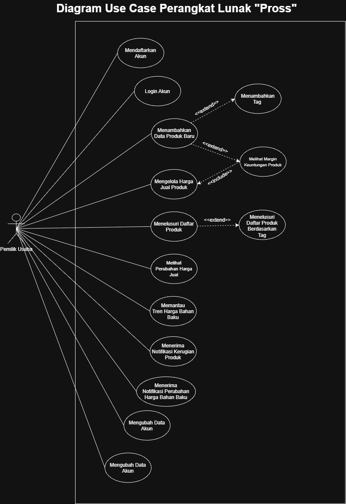

<h1>
IF2150 REKAYASA PERANGKAT LUNAK
 
TUGAS 3
 
USE CASE & SCENARIO USE CASE
</h1>
 

## *Nama Perangkat Lunak*

### Untuk: *Stefani Angeline Oroh*

Dipersiapkan oleh:
| Informasi | Keterangan |
| --- | --- |
| Kelas | *K02* |
| Kelompok | *G07*  |

| NIM | Nama |
| --- | --- |
| *13525002* | *Ahmad Boutros Fathir* |
| *13525020* | *Klio Lysander* |
| *13525047* | *Muhammad Fakhriyan Rizki M.* |
| *13525053* | *Kevin Sie* |
| *13525056* | *Mochammad Nuha Al Ghifari* |
| *13525062* | *Rafel Dzinun Muhammad* |
---
## Daftar Perubahan

| Revisi | Deskripsi |
| :--- | :--- |
| *A* | *Terdapat perubahan ID KF pada Use Case 5 dan 6.* |
| *B* | *Memperbaiki KF berdasarkan dokumen M2 dan menghapus Use Case 6 (digabungkan dengan Use Case3)* |

 
 

# BAB 1: Deskripsi Perangkat Lunak
Perangkat lunak Pross merupakan aplikasi mobile manajemen Harga Pokok Penjualan (HPP) yang diperuntukkan khusus untuk pelaku kuliner UMKM yang ada di Bandung. Ekspektasi utama pengguna adalah terdapat sistem pemantauan profitabilitas menu yang praktis tanpa memerlukan sistem pembukuan pembukuan dan perhitungan yang rumit, sehingga mengamankan margin keuntungan ketika perubahan harga bahan baku. Alur kerja sistem dimulai dengan pengguna memasukkan daftar bahan baku, takaran pasti per produk, dan harga jual produk. Secara berkala, pengguna memperbarui data harga beli bahan baku. Sistem kemudian menghitung ulang biaya produksi secara otomatis. Apabila margin keuntungan menipis atau masuk ke fase rugi akibat lonjakan harga pasar, sistem akan langsung memicu push notification sebagai peringatan. Penerapan solusi ini diharapkan dapat menjadi langkah pengamanan pelaku UMKM dalam mengatasi kerugian. Melalui peringatan otomatis dan ketersediaan data tren harga, pemilik usaha dapat merespons perubahan harga pasar seperti menyesuaikan takaran atau mengubah harga jual sehingga terhindar dari kerugian operasional yang berlarut-larut.

---

# BAB 2: Kebutuhan Fungsional (KF)

| ID KF | ID Kebutuhan | Penjelasan |
| :--- | :--- | :--- |
| *KF01* | *R01* | *Sistem harus menyediakan halaman registrasi akun bagi pengguna baru* |
| *KF02* | *R02* | *Ketika pengguna berhasil melakukan registrasi, sistem harus dapat menyimpan data pengguna baru ke dalam database* |
| *KF03* | *R04* | *Ketika pengguna akan masuk ke dalam akun, sistem harus menyediakan halaman login berupa username dan password dengan password dapat diatur visibilitynya* |
| *KF04* | *R05* | *Ketika pengguna login, sistem harus mencocokkan username dan password sesuai dengan data yang tersimpan di database* |
| *KF05* | *R06* | *Ketika pengguna menambahkan produk, sistem harus dapat memungkinkan pengguna menginput daftar bahan baku beserta dengan takaran yang digunakan untuk produk tertentu* |
| *KF06* | *R07* | *Sistem harus menyediakan langkah konfirmasi sebelum data bahan baku disimpan* |
| *KF07* | *R07* | *Ketika pengguna mengonfirmasi takaran bahan baku, sistem harus menyimpan data ke dalam database* |
| *KF08* | *R08* | *Ketika data bahan baku dan takarannya telah tersimpan, sistem harus menghitung total modal awal produk secara otomatis.* |
| *KF09* | *R09 dan R14* | *Ketika pengguna menambahkan atau menyesuaikan produk, sistem harus dapat memungkinkan pengguna menginput harga jual suatu produk* |
| *KF10* | *R10 dan R15* | *Ketika pengguna menambahkan atau menyesuaikan harga jual, sistem harus menyimpan data tersebut ke dalam database sesuai dengan produknya* |
| *KF11* | *R11* | *Ketika harga modal dan harga jual tersedia, sistem harus membandingkan harga keduanya secara otomatis* |
| *KF12* | *R12* | *Ketika terdapat perbandingan harga modal dan harga jual, sistem harus menghitung keuntungan atau kerugian dan menampilkannya kepada pengguna* |
| *KF13* | *R16* | *Sistem memungkinkan pengguna untuk memberi nama dan tag pada suatu produk* |
| *KF14* | *R17* | *Ketika pengguna memberikan nama atau tag, sistem harus menyimpan nama atau tag tersebut ke dalam database* |
| *KF15* | *R18 dan R19* | *Sistem harus menampilkan daftar seluruh produk yang tersimpan di database kepada pengguna* |
| *KF16* | *R20* | *Ketika harga jual suatu produk berubah, sistem harus menyimpan perubahan tersebut sebagai data historis* |
| *KF17* | *R21 dan R22* | *Sistem harus menampilkan grafik tren perubahan harga jual suatu produk berdasarkan data historis* |
| *KF18* | *R23* | *Ketika harga bahan baku berubah, sistem harus menyimpan perubahan tersebut sebagai data historis* |
| *KF19* | *R24 dan R25* | *Sistem harus menampilkan grafik tren perubahan harga jual suatu produk berdasarkan data historis* |
| *KF20* | *R26 dan R27* | *Ketika suatu produk mengalami margin negatif, sistem harus mengirimkan notifikasi kepada pengguna* |
| *KF21* | *R28 dan R29* | *Ketika pengguna mencari produk berdasarkan nama, tag, atau bahan baku, sistem harus dapat menampilkan daftar produk terkait* |
| *KF22* | *R30 dan R31* | *Ketika terjadi perubahan harga pada suatu bahan baku, sistem harus mengirimkan notifikasi kepada pengguna terkait produk yang relevan* | 
| *KF23* | *R32 dan R33* | *Sistem harus memungkinkan pengguna melihat dan mengubah data profil akun (nama usaha, email, password, nomor telepon) serta menyimpan perubahannya ke dalam database* | 
| *KF24* | *R34 dan R35* | *Ketika pengguna memilih logout akun, sistem harus mengakhiri sesi aktif pengguna pada perangkat* | 

---

# BAB 3: Model Use Case

## 3.1 Identifikasi Aktor

| Aktor | Deskripsi |
| :--- | :--- |
| *Pemilik Usaha* | *Pengguna utama sistem yang mengelola data setiap produk, memantau keuntungan/kerugian, menerima notifikasi kerugian, dan melihat tren harga bahan baku untuk pengambilan keputusan bisnis.* |

## 3.2 Identifikasi Use Case

| ID UC | Nama Use Case | Deskripsi Singkat | Aktor Terlibat | ID KF Terkait |
| :--- | :--- | :--- | :--- | :--- |
| *UC01* | *Mendaftarkan Akun* | *Pemilik usaha membuat akun baru untuk menyimpan data usahanya di sistem.* | *Pemilik Usaha* | *KF01, KF02* |
| *UC02* | *Login dengan akun yang sudah terdaftar* | *Pemilik usaha dapat melakukan login sesuai dengan username dan password yang telah dibuat.* | *Pemilik Usaha* | *KF03, KF04* |
| *UC03* | *Menambahkan Data Produk Baru* | *Pemilik usaha menambahkan produk baru dengan resep bahan baku, tag, dan harga jual awal.* | *Pemilik Usaha* | *KF05, KF06, KF07, KF08, KF09, KF13, KF14* |
| *UC04* | *Melihat Margin Keuntungan Produk* | *Pemilik usaha dapat melihat keuntungan/kerugian pada produk yang telah ditambahkan* | *Pemilik Usaha* | *KF10, KF11, KF12* |
| *UC05* | *Mengelola Harga Jual Produk* | *Pemilik usaha dapat memperbarui harga jual produk agar sesuai dengan margin* | *Pemilik Usaha* | *KF08, KF09* |
| *UC06* | *Menelusuri Daftar Produk* | *Pemilik usaha dapat mencari dan melihat produk berdasarkan nama dan tag yang diinput* | *Pemilik Usaha* | *KF14, KF15, K21* |
| *UC07* | *Melihat Perubahan Harga Jual* | *Pemilik usaha dapat melihat data historis perubahan harga jual suatu produk* | *Pemilik Usaha* | *KF17, KF18* |
| *UC08* | *Memantau Tren Harga Bahan Baku* | *Pemilik usaha dapat melihat grafik perubahan harga bahan baku secara historis maupun real-time* | *Pemilik Usaha* | *KF19, KF20* |
| *UC09* | *Menerima Notifikasi Kerugian Produk* | *Pemilik usaha dapat mendapatkan peringatan ketika produk tertentu mengalami kerugian akibat perubahan harga bahan baku* | *Pemilik Usaha* | *KF20* |
| *UC10* | *Menerima Notifikasi Perubahan Harga Bahan Baku* | *Pemilik usaha dapat menerima peringatan ketika suatu bahan baku tertentu mengalami kenaikan harga.* | *Pemilik Usaha* | *KF22* |
| *UC11* | *Mengubah Data Akun* | *Pemilik usaha dapat mengubah data terkait akun pemilik usaha (Nama Usaha, Email, Password, dan Nomor Telepon) pada laman Profile.* | *Pemilik Usaha* | *KF23* |
| *UC12* | *Keluar dari Akun* | *Pemilik usaha keluar dari akun yang terdapat pada aplikasi.* | *Pemilik Usaha* | *KF24* |

## 3.3 Use Case Diagram
 

<i>Gambar 1. Use Case Diagram Perangkat Lunak Pross</i>

 

## 3.4 Skenario Use Case
### 3.4.1 Skenario UC01

**Nama Use Case:** *Mendaftarkan Akun*

**Skenario Normal**

| No | Aksi Aktor | Reaksi Perangkat Lunak |
| :--- | :--- | :--- |
| 1 | *Pemiliki usaha membuka perangkat lunak* | *Sistem menampilkan halaman registrasi/login* |
| 2 | *Pemilik usaha memilih opsi registrasi* | *Sistem mengarahkan ke halaman pembuatan akun* |
| 3 | *Pemilik usaha mengisi seluruh data registrasi yang dibutuhkan dan melakukan konfirmasi dengan menekan tombol "Buat Akun"* | *Sistem menerima respons pembuatan okun, menyimpan data pengguna ke database, dan menampilkan halaman utama perangkat lunak* |

 

**Skenario Alternatif 1: Data Registrasi Belum Lengkap**

| No | Aksi Aktor | Reaksi Perangkat Lunak |
| :--- | :--- | :--- |
| 1 | *Pemiliki usaha membuka perangkat lunak* | *Sistem menampilkan halaman registrasi/login* |
| 2 | *Pemilik usaha memilih opsi registrasi* | *Sistem mengarahkan ke halaman pembuatan akun* |
| 3 | *Pemilik usaha mengisi data registrasi secara tidak lengkap dan melakukan konfirmasi dengan menekan tombol "Buat Akun"* | *Sistem mendeteksi adanya data yang belum diisi dan menampilkan pesan error "Data Registrasi Belum Lengkap". Sistem akan meminta pengguna untuk mengisi data registrasi hingga lengkap* |

 

**Skenario Alternatif 2: Akun yang Dibuat Sudah Terdaftar**

| No | Aksi Aktor | Reaksi Perangkat Lunak |
| :--- | :--- | :--- |
| 1 | *Pemiliki usaha membuka perangkat lunak* | *Sistem menampilkan halaman registrasi/login* |
| 2 | *Pemilik usaha memilih opsi registrasi* | *Sistem mengarahkan ke halaman pembuatan akun* |
| 3 | *Pemilik usaha mengisi seluruh data registrasi yang dibutuhkan dan melakukan konfirmasi dengan menekan tombol "Buat Akun"* | *Sistem mendeteksi bahwa data yang diinput sudah terdapat di database, menandakan bahwa akun sudah pernah dibuat. Sistem akan memberikan pesan "Akun sudah dibuat" dan mengembalikan pengguna pada halaman registrasi agar pengguna dapat mengganti data* |

 

**Skenario Alternatif 3: Password tidak memenuhi ketentuan yang diberikan**

| No | Aksi Aktor | Reaksi Perangkat Lunak |
| :--- | :--- | :--- |
| 1 | *Pemiliki usaha membuka perangkat lunak* | *Sistem menampilkan halaman registrasi/login* |
| 2 | *Pemilik usaha memilih opsi registrasi* | *Sistem mengarahkan ke halaman pembuatan akun* |
| 3 | *Pemilik usaha mengisi seluruh data registrasi yang dibutuhkan dan melakukan konfirmasi dengan menekan tombol "Buat Akun"* | *Sistem mendeteksi bahwa password yang diinput tidak sesuai dengan ketentuan dan memberikan pesan "Password terlalu lemah" dan mengembalikan pengguna pada halaman registrasi agar pengguna dapat memperbaiki password* |

 

### 3.4.2 Skenario UC02

**Nama Use Case:** *Login Dengan Akun yang Sudah Terdaftar*

**Skenario Normal**

| No | Aksi Aktor | Reaksi Perangkat Lunak |
| :--- | :--- | :--- |
| 1 | *Pemiliki usaha membuka perangkat lunak* | *Sistem menampilkan halaman registrasi/login* |
| 2 | *Pemilik usaha memilih opsi login* | *Sistem mengarahkan ke halaman login* |
| 3 | *Pemilik usaha mengisi username dan password dari akun yang ingin di login dengan tepat dan melakukan konfirmasi dengan menekan tombol "Login"* | *Sistem menerima respons data akun, memverifikasi data, dan menampilkan halaman utama perangkat lunak* |

 

**Skenario Alternatif 1: Username atau Password Tidak Sesuai**

| No | Aksi Aktor | Reaksi Perangkat Lunak |
| :--- | :--- | :--- |
| 1 | *Pemiliki usaha membuka perangkat lunak* | *Sistem menampilkan halaman registrasi/login* |
| 2 | *Pemilik usaha memilih opsi login* | *Sistem mengarahkan ke halaman login* |
| 3 | *Pemilik usaha mengisi username dan password dari akun yang ingin di login, tetapi salah satu atau keduanya tidak tepat dan melakukan konfirmasi dengan menekan tombol "Login"* | *Sistem menerima respons data akun, memverifikasi data, mendeteksi ketidaksesuaian, dan menampilkan pesan error "Username atau Password Salah"* |

 

**Skenario Alternatif 2: Akun Belum Dibuat**

| No | Aksi Aktor | Reaksi Perangkat Lunak |
| :--- | :--- | :--- |
| 1 | *Pemiliki usaha membuka perangkat lunak* | *Sistem menampilkan halaman registrasi/login* |
| 2 | *Pemilik usaha memilih opsi login* | *Sistem mengarahkan ke halaman login* |
| 3 | *Pemilik usaha mengisi username dan password dari akun yang belum pernah dibuat dan melakukan konfirmasi dengan menekan tombol "Login"* | *Sistem menerima respons data akun, memverifikasi data, gagal menemukan data, dan menampilkan pesan error "Tidak dapat menemukan akun"* |    

 

**Skenario Alternatif 3: Reset Password**

| No | Aksi Aktor | Reaksi Perangkat Lunak |
| :--- | :--- | :--- |
| 1 | *Pemiliki usaha membuka perangkat lunak* | *Sistem menampilkan halaman registrasi/login* |
| 2 | *Pemilik usaha memilih opsi login* | *Sistem mengarahkan ke halaman login* |
| 3 | *Pemilik usaha mengisi username dan password dari akun yang belum pernah dibuat dan melakukan konfirmasi dengan menekan tombol "Login"* | *Sistem menerima respons data akun, memverifikasi data, gagal mencocokan data pengguna, dan menampilkan pesan error "Username atau Password Salah"* |    
| 4 | *Pemilik usaha menekan tombol "Lupa Password* | *Sistem mengalihkan Pengguna menuju laman reset password* |
| 5 | *Pemilik usaha mengisi password baru* | *Sistem menyikpan data password baru yang telah diisi oleh pengguna* |    

 

### 3.4.3 Skenario UC03

**Nama Use Case:** *Menambahkan Data Produk Baru*

**Skenario Normal**

| No | Aksi Aktor | Reaksi Perangkat Lunak |
| :--- | :--- | :--- |
| 1 | *Pemilik usaha menekan tombol "+" pada halaman dashboard* | *Sistem mengalihkan pengguna menuju halaman penambahan produk baru* |
| 2 | *Pemilik usaha menginput nama dari produk beserta tag (opsional) dan melakukan konfirmasi dengan menekan tombol "Ok"* | *Sistem menerima input nama produk, tag, memverifikasi nama, menyimpan nama dan tag ke database, dan menampilkan halaman menu "Tambah Produk Baru" yang melibatkan input bahan baku, takaran, dan harga jual* |
| 3 | *Pemilik usaha menginput bahan baku, takarannya, dan harga jualnya, lalu melakukan konfirmasi dengan menekan tombol "Kalkulasi"* | *Sistem menerima input data, dan menyimpannya di database* |

 

**Skenario Alternatif 1: Nama Produk Sudah Pernah Dibuat**

| No | Aksi Aktor | Reaksi Perangkat Lunak |
| :--- | :--- | :--- |
| 1 | *Pemilik usaha menekan tombol "+" pada halaman utama* | *Sistem mengalihkan pengguna menuju halaman penambahan produk baru* |
| 2 | *Pemilik usaha menginput nama dari produk yang sudah pernah dibuat beserta tag (opsional) dan melakukan konfirmasi dengan menekan tombol "Ok"* | *Sistem menerima input nama produk, memverifikasi nama, mendeteksi bahwa nama produk sudah terdapat di database, dan memberikan pesan error "Nama Produk Sudah Pernah Dibuat". Sistem akan mengembalikan pengguna pada halaman input nama produk dan tag* |

 

**Skenario Alternatif 2: Input Jumlah Takaran atau Harga Jual Invalid**

| No | Aksi Aktor | Reaksi Perangkat Lunak |
| :--- | :--- | :--- |
| 1 | *Pemilik usaha menekan tombol "+" pada halaman utama* | *Sistem mengalihkan pengguna menuju halaman penambahan produk baru* |
| 2 | *Pemilik usaha menginput nama dari produk beserta tag (opsional) dan melakukan konfirmasi dengan menekan tombol "Ok"* | *Sistem menerima input nama produk, memverifikasi nama, menyimpan namanya ke database, dan menampilkan halaman menu "Tambah Produk Baru" yang melibatkan input bahan baku, takaran, dan harga jual* |
| 3 | *Pemilik usaha menginput bahan baku, takarannya, dan harga jualnya, tetapi nilainya invalid, lalu melakukan konfirmasi dengan menekan tombol "Kalkulasi" * | *Sistem menerima input data, mendeteksi nilai yang invalid, lalu memberikan pesan error "Input Takaran / Harga Jual Tidak Valid" dan mengembalikan pengguna pada halaman "Tambah Produk Baru"* |

 

### 3.4.4 Skenario UC04

**Nama Use Case:** *Melihat Margin Keuntungan Produk*

**Skenario Normal**

| No | Aksi Aktor | Reaksi Perangkat Lunak |
| :--- | :--- | :--- |
| 1 | *Setelah konfirmasi, pemilik usaha akan melihat perbandingan nilai harga jual yang ditetapkan dengan harga standar berdasarkan bahan baku* | *Sistem melakukan perbandingan terhadap harga jual dan harga standar, menemukan bahwa margin bernilai positif, lalu menampilkan data harga dan margin* |
| 2 | *Pemilik usaha melakukan konfirmasi setelah melihat margin yang bernilai positif dengan menekan tombol "Selesai"* | *Sistem mengembalikan pengguna ke halaman utama* |

 

**Skenario Alternatif 1: Harga Jual yang Ditetapkan Rugi**

| No | Aksi Aktor | Reaksi Perangkat Lunak |
| :--- | :--- | :--- |
| 1 | *Setelah konfirmasi, pemilik usaha akan melihat perbandingan nilai harga jual yang ditetapkan dengan harga standar berdasarkan bahan baku* | *Sistem melakukan perbandingan terhadap harga jual dan harga standar, menemukan bahwa margin bernilai negatif, lalu menampilkan data hargam margin, dan pesan "Harga Jual yang Ditetapkan Memiliki Margin Negatif". Sistem akan meminta pengguna untuk mengganti harga jual* |
| 2 | *Pemilik usaha melakukan perbaikan terhadap nilai harga jual dan melakukan konfirmasi ulang.* | *Sistem melakukan perbandingan terhadap harga jual baru dan harga standar, menemukan bahwa margin bernilai positif, lalu menampilkan data harga dan margin* |
| 3 | *Pemilik usaha melakukan konfirmasi setelah melihat margin yang bernilai positif dengan menekan tombol "Selesai"* | *Sistem mengembalikan pengguna ke halaman utama* |

 

### 3.4.5 Skenario UC05

**Nama Use Case:** *Mengelola Harga Jual Produk*

**Skenario Normal**

| No | Aksi Aktor | Reaksi Perangkat Lunak |
| :--- | :--- | :--- |
| 1 | *Pemilik usaha memilih produk yang ingin diedit harga jualnya* | *Sistem mengalihkan pengguna menuju halaman edit untuk produk yang dipilih* |
| 2 | *Pemilik usaha mengisi dan menyimpan harga jual produk yang baru* | *Sistem memvalidasi dan menyimpan harga jual produk yang baru kedalam database lalu menampilkan pesan "Berhasil Diedit"* |

 

**Skenario Alternatif 1: Input Bukan Merupakan Bilangan Positif**
| No | Aksi Aktor | Reaksi Perangkat Lunak |
| :--- | :--- | :--- |
| 1 | *Pemilik usaha memilih produk yang ingin diedit harga jualnya* | *Sistem mengalihkan pengguna menuju halaman edit untuk produk yang dipilih* |
| 2 | *Pemilik usaha mengetikkan dan menyimpan harga jual produk yang baru namun bukan merupakan bilangan positif* | *Sistem memvalidasi namun tidak berhasil menyimpan harga jual produk yang baru kedalam database lalu menampilkan pesan "Masukkan bilangan positif"* |

### 3.4.6 Skenario UC06

**Nama Use Case:** *Menelusuri Daftar Produk*

**Skenario Normal**

| No | Aksi Aktor | Reaksi Perangkat Lunak |
| :--- | :--- | :--- |
| 1 | *Pemilik Usaha mengetik keyword nama atau tag yang ingin dicari pada menu searching* | *Sistem mencari semua produk dengan nama atau tag yang relevan dan memunculkan beberapa produk yang memiliki keyword nama atau/dan tag terkait* |
| 2 | *Pemilik Usaha menekan tombol search* | *Sistem menampilkan semua produk dengan nama atau tag yang diinput* |

 

**Skenario Alternatif 1: Produk tidak ditemukan**

| No | Aksi Aktor | Reaksi Perangkat Lunak |
| :--- | :--- | :--- |
| 1 | *Pemilik Usaha mengetik keyword nama atau tag yang ingin dicari pada menu searching* | *Sistem mencari semua produk dengan nama atau tag yang relevan dan memunculkan beberapa produk yang memiliki keyword nama atau/dan tag terkait* |
| 2 | *Pemilik Usaha menekan tombol search* | *Sistem tidak dapat menampilkan produk dengan nama atau tag yang diinput dan menampilkan pesan "Tidak ada produk yang relevan"* |

### 3.4.7 Skenario UC07

**Nama Use Case:** *Melihat Perubahan Harga Jual*

**Skenario Normal**

| No | Aksi Aktor | Reaksi Perangkat Lunak |
| :--- | :--- | :--- |
| 1 | *Pemilik Usaha memilih suatu produk spesifik dari daftar produk yang terdapat pada halaman utama.* | *Sistem menampilkan halaman detail dari produk yang dipilih.* |
| 2 | *Pemilik Usaha menekan tombol atau tab "Riwayat Harga".* | *Sistem mengambil data historis dari database dan menampilkan daftar urutan perubahan harga jual produk tersebut beserta tanggal perubahannya.* |

 

**Skenario Alternatif 1: Belum Ada Data Historis**

| No | Aksi Aktor | Reaksi Perangkat Lunak |
| :--- | :--- | :--- |
| 1 | *Pemilik Usaha memilih suatu produk spesifik dari daftar produk yang terdapat pada halaman utama.* | *Sistem menampilkan halaman detail dari produk yang dipilih.* |
| 2 | *Pemilik Usaha menekan tombol atau tab "Riwayat Harga".* | *Sistem mendeteksi bahwa produk belum pernah mengalami perubahan harga jual sejak pertama kali dibuat dan menampilkan pesan "Belum ada riwayat perubahan harga untuk produk ini".* |

 

### 3.4.8 Skenario UC08

**Nama Use Case:** *Memantau Tren Harga Bahan Baku*

**Skenario Normal**

| No | Aksi Aktor | Reaksi Perangkat Lunak |
| :--- | :--- | :--- |
| 1 | *Pemilik Usaha melihat data perubahan harga bahan baku pada halaman utama.* | *Sistem memuat dan menampilkan daftar seluruh bahan baku yang pernah diinput ke dalam sistem.* |
| 2 | *Pemilik Usaha memilih salah satu bahan baku.* | *Sistem mengumpulkan data historis harga dari bahan baku tersebut dan mengonversinya menjadi visualisasi grafik tren harga.* |
| 3 | *Pemilik Usaha mengubah rentang waktu pada grafik.* | *Sistem memuat ulang grafik dan memperbarui tampilan visual sesuai dengan rentang waktu yang dipilih.* |

 

**Skenario Alternatif 1: Data Tidak Memenuhi Syarat Grafik**

| No | Aksi Aktor | Reaksi Perangkat Lunak |
| :--- | :--- | :--- |
| 1 | *Pemilik Usaha melihat data perubahan harga bahan baku pada halaman utama.* | *Sistem memuat dan menampilkan daftar seluruh bahan baku yang pernah diinput ke dalam sistem.* |
| 2 | *Pemilik Usaha memilih bahan baku yang baru saja ditambahkan.* | *Sistem mendeteksi bahwa jumlah titik data belum cukup untuk membentuk grafik dan menampilkan pesan "Data belum cukup untuk memvisualisasikan grafik tren harga".* |

 

**Skenario Alternatif 2: Bahan Baku Belum Pernah Mengalami Pembaruan Harga**

| No | Aksi Aktor | Reaksi Perangkat Lunak |
| :--- | :--- | :--- |
| 1 | *Pemilik Usaha melihat data perubahan harga bahan baku pada halaman utama.* | *Sistem memuat dan menampilkan daftar seluruh bahan baku yang pernah diinput ke dalam sistem.* |
| 2 | *Pemilik Usaha memilih bahan baku yang harganya belum pernah diperbarui sejak pertama didaftarkan.* | *Sistem menampilkan harga saat ini berupa teks nominal tanpa memuat grafik garis, disertai keterangan "Belum ada riwayat fluktuasi harga untuk bahan baku ini".* |

### 3.4.9 Skenario UC09

**Nama Use Case:** *Menerima Notifikasi Kerugian Produk*

**Skenario Normal**

| No | Aksi Aktor | Reaksi Perangkat Lunak |
| :--- | :--- | :--- |
| 1 | *Pemilik Usaha memperbarui harga jual bahan baku yang mengalami kenaikan.* | *Sistem menyimpan harga baru, melakukan kalkulasi HPP ulang, dan mendeteksi bahwa ada produk yang margin keuntungannya bernilai negatif.* |
| 2 | *Pemilik Usaha menutup aplikasi atau berpindah halaman.* | *Sistem memicu dan mengirimkan push notification ke perangkat Pemilik Usaha yang berisi nama produk yang terdampak.* |
| 3 | *Pemilik Usaha menekan push notification tersebut pada layar smartphone.* | *Sistem membuka aplikasi dan langsung mengarahkan pengguna ke halaman detail produk yang merugi tersebut.* |

 

**Skenario Alternatif 1: Pemilik Usaha Mengabaikan Push Notification**

| No | Aksi Aktor | Reaksi Perangkat Lunak |
| :--- | :--- | :--- |
| 1 | *Pemilik Usaha memperbarui harga jual bahan baku yang mengalami kenaikan.* | *Sistem memproses kenaikan harga, mendeteksi kerugian, dan mengirimkan push notification.* |
| 2 | *Pemilik Usaha mengabaikan atau menghapus (swipe) notifikasi tersebut dari layar.* | *Sistem tetap menyematkan label peringatan visual (ikon alert merah) pada produk yang bersangkutan di database UI.* |
| 3 | *Pemilik Usaha membuka halaman Daftar Produk secara manual.* | *Sistem menampilkan daftar produk beserta ikon peringatan kerugian yang masih aktif pada produk yang terdampak.* |

### 3.4.10 Skenario UC10

**Nama Use Case:** *Menerima Notifikasi Perubahan Harga Bahan Baku*

**Skenario Normal**

| No | Aksi Aktor | Reaksi Perangkat Lunak |
| :--- | :--- | :--- |
| 1 | *Pemilik Usaha memperbarui harga jual bahan baku yang mengalami kenaikan.* | *Sistem menyimpan harga baru, melakukan kalkulasi HPP ulang, dan mendeteksi bahwa ada produk yang margin keuntungannya bernilai negatif.* |
| 2 | *Pemilik Usaha menutup aplikasi atau berpindah halaman.* | *Sistem memicu dan mengirimkan push notification ke perangkat Pemilik Usaha yang berisi nama produk yang terdampak.* |
| 3 | *Pemilik Usaha menekan push notification tersebut pada layar smartphone.* | *Sistem membuka aplikasi dan langsung mengarahkan pengguna ke halaman utama.* |

 

**Skenario Alternatif 1: Pemilik Usaha Mengabaikan Push Notification**

| No | Aksi Aktor | Reaksi Perangkat Lunak |
| :--- | :--- | :--- |
| 1 | *Pemilik Usaha memperbarui harga jual bahan baku yang mengalami kenaikan.* | *Sistem memproses kenaikan harga, mendeteksi kerugian, dan mengirimkan push notification.* |
| 2 | *Pemilik Usaha mengabaikan atau menghapus (swipe) notifikasi tersebut dari layar.* | *Sistem menyimpan notifikasi perubahan harga jual pada menu notifikasi dalam perangkat lunak* |
| 3 | *Pemilik Usaha menekan menu notifikasi pada halaman utama.* | *Sistem menampilkan list notifikasi pada menu notifikasi.* |

### 3.4.11 Skenario UC11

**Nama Use Case:** *Mengubah Mengubah Data Akun*

**Skenario Normal**

| No | Aksi Aktor | Reaksi Perangkat Lunak |
| :--- | :--- | :--- |
| 1 | *Pemilik Usaha menekan tombol "Profile" pada aplikasi.* | *Sistem mengalihkan pengguna menuju halaman "Profile".* |
| 2 | *Pemilik Usaha mengubah data pada akun Pemilik Usaha dan menekan tombol "Change".* | *Sistem memperbarui data milik Pemilik Usaha pada database.* |

 

### 3.4.12 Skenario UC12

**Nama Use Case:** *Keluar dari Akun*

**Skenario Normal**

| No | Aksi Aktor | Reaksi Perangkat Lunak |
| :--- | :--- | :--- |
| 1 | *Pemilik Usaha menekan tombol "Profile" pada aplikasi.* | *Sistem mengalihkan pengguna menuju halaman "Profile".* |
| 2 | *Pemilik Usaha menekan tombol "Logout" pada halaman "Profile".* | *Sistem menampilkan pop-up "Konfirmasi Logout".* |
| 2 | *Pemilik Usaha menekan tombol "Ya" pada pop-up "Konfirmasi Logout".* | *Sistem mengalihkan pengguna menuju halaman "Login" kembali setelah Pengguna menekan tombol "Logout".* |

 

**Skenario Alternatif 1: Pemilik Usaha Menekan Tombol "Tidak"**

| No | Aksi Aktor | Reaksi Perangkat Lunak |
| :--- | :--- | :--- |
| 1 | *Pemilik Usaha menekan tombol "Profile" pada aplikasi.* | *Sistem mengalihkan pengguna menuju halaman "Profile".* |
| 2 | *Pemilik Usaha menekan tombol "Logout" pada halaman "Profile".* | *Sistem menampilkan pop-up "Konfirmasi Logout".* |
| 2 | *Pemilik Usaha menekan tombol "Tidak" pada pop-up "Konfirmasi Logout".* | *Sistem mengembalikan tampilan aplikasi menjadi halaman "Profile" kembali.* |
