<h1>
IF2150 REKAYASA PERANGKAT LUNAK
 
TUGAS 4
 
CLASS DIAGRAM
</h1>
 

## *Pross*

### Untuk: *Stefani Angeline Oroh*

Dipersiapkan oleh:
| Informasi | Keterangan |
| --- | --- |
| Kelas | *K02* |
| Kelompok | *G07*  |

| NIM | Nama |
| --- | --- |
| *13525002* | *Ahmad Boutros Fathir* |
| *13525020* | *Klio Lysander* |
| *13525047* | *Muhammad Fakhriyan Rizki M.* |
| *13525053* | *Kevin Sie* |
| *13525056* | *Mochammad Nuha Al Ghifari* |
| *13525062* | *Rafel Dzinun Muhammad* |
---

## Daftar Perubahan

| Revisi | Deskripsi |
| :--- | :--- |
| *A* | *Deskripsikan perubahan yang dilakukan dari dokumen sebelumnya pada dokumen ini. Jika tidak terdapat perubahan, harap kosongkan tabel.* |
| *B* |  |
| *C* |  |
| ... |  |

 
 

# BAB 1: Deskripsi Perangkat Lunak

Perangkat lunak Pross merupakan aplikasi mobile manajemen Harga Pokok Penjualan (HPP) yang diperuntukkan khusus untuk pelaku kuliner UMKM yang ada di Bandung. Ekspektasi utama pengguna adalah terdapat sistem pemantauan profitabilitas menu yang praktis tanpa memerlukan sistem pembukuan pembukuan dan perhitungan yang rumit, sehingga mengamankan margin keuntungan ketika perubahan harga bahan baku. Alur kerja sistem dimulai dengan pengguna memasukkan daftar bahan baku, takaran pasti per produk, dan harga jual produk. Secara berkala, pengguna memperbarui data harga beli bahan baku. Sistem kemudian menghitung ulang biaya produksi secara otomatis. Apabila margin keuntungan menipis atau masuk ke fase rugi akibat lonjakan harga pasar, sistem akan langsung memicu push notification sebagai peringatan. Penerapan solusi ini diharapkan dapat menjadi langkah pengamanan pelaku UMKM dalam mengatasi kerugian. Melalui peringatan otomatis dan ketersediaan data tren harga, pemilik usaha dapat merespons perubahan harga pasar seperti menyesuaikan takaran atau mengubah harga jual sehingga terhindar dari kerugian operasional yang berlarut-larut.

---

# BAB 2: Kebutuhan Fungsional

## 2.1 Kebutuhan Fungsional

Tabel 2.1. Daftar Kebutuhan Fungsional

| ID KF | ID Kebutuhan | Penjelasan |
| :--- | :--- | :--- |
| *KF01* | *R01* | *Sistem harus menyediakan halaman registrasi akun bagi pengguna baru* |
| *KF02* | *R02* | *Ketika pengguna berhasil melakukan registrasi, sistem harus dapat menyimpan data pengguna baru ke dalam database* |
| *KF03* | *R04* | *Ketika pengguna akan masuk ke dalam akun, sistem harus menyediakan halaman login berupa username dan password dengan password dapat diatur visibilitynya* |
| *KF04* | *R05* | *Ketika pengguna login, sistem harus mencocokkan username dan password sesuai dengan data yang tersimpan di database* |
| *KF05* | *R06* | *Ketika pengguna menambahkan produk, sistem harus dapat memungkinkan pengguna menginput daftar bahan baku beserta dengan takaran yang digunakan untuk produk tertentu* |
| *KF06* | *R07* | *Sistem harus menyediakan langkah konfirmasi sebelum data bahan baku disimpan* |
| *KF07* | *R07* | *Ketika pengguna mengonfirmasi takaran bahan baku, sistem harus menyimpan data ke dalam database* |
| *KF08* | *R08* | *Ketika data bahan baku dan takarannya telah tersimpan, sistem harus menghitung total modal awal produk secara otomatis * |
| *KF09* | *R09 dan R14* | *Ketika pengguna menambahkan atau menyesuaikan produk, sistem harus dapat memungkinkan pengguna menginput harga jual suatu produk* |
| *KF10* | *R10 dan R15* | *Ketika pengguna menambahkan atau menyesuaikan harga jual, sistem harus menyimpan data tersebut ke dalam database sesuai dengan produknya* |
| *KF11* | *R11* | *Ketika harga modal dan harga jual tersedia, sistem harus membandingkan harga keduanya secara otomatis* |
| *KF12* | *R12* | *Ketika terdapat perbandingan harga modal dan harga jual, sistem harus menghitung keuntungan atau kerugian dan menampilkannya kepada pengguna* |
| *KF13* | *R16* | *Sistem memungkinkan pengguna untuk memberi nama dan tag pada suatu produk* |
| *KF14* | *R17* | *Ketika pengguna memberikan nama atau tag, sistem harus menyimpan nama atau tag tersebut ke dalam database* |
| *KF15* | *R18 dan R19* | *Sistem harus menampilkan daftar seluruh produk yang tersimpan di database kepada pengguna* |
| *KF16* | *R20* | *Ketika harga jual suatu produk berubah, sistem harus menyimpan perubahan tersebut sebagai data historis* |
| *KF17* | *R21 dan R22* | *Sistem harus menampilkan grafik tren perubahan harga jual suatu produk berdasarkan data historis* |
| *KF18* | *R23* | *Ketika harga bahan baku berubah, sistem harus menyimpan perubahan tersebut sebagai data historis* |
| *KF19* | *R24 dan R25* | *Sistem harus menampilkan grafik tren perubahan harga jual suatu produk berdasarkan data historis* |
| *KF20* | *R26 dan R27* | *Ketika suatu produk mengalami margin negatif, sistem harus mengirimkan notifikasi kepada pengguna* |
| *KF21* | *R28 dan R29* | *Ketika pengguna mencari produk berdasarkan nama, tag, atau bahan baku, sistem harus dapat menampilkan daftar produk terkait* |
| *KF22* | *R30 dan R31* | *Ketika terjadi perubahan harga pada suatu bahan baku, sistem harus mengirimkan notifikasi kepada pengguna terkait produk yang relevan* | 
| *KF23* | *R32 dan R33* | *Sistem harus memungkinkan pengguna melihat dan mengubah data profil akun (nama usaha, email, password, nomor telepon) serta menyimpan perubahannya ke dalam database* | 
| *KF24* | *R34 dan R35* | *Ketika pengguna memilih logout akun, sistem harus mengakhiri sesi aktif pengguna pada perangkat* | 

---

# BAB 3: Model Use Case

## 3.1 Identifikasi Aktor

Tuliskan kembali daftar aktor yang terlibat dan deskripsi perannya dalam perangkat lunak (P/L). Deskripsi peran harus menjelaskan wewenang aktor tersebut dalam perangkat lunak. Perlu diingat bahwa aktor yang dimaksud adalah pengguna yang berinteraksi langsung dengan P/L. Komponen seperti database, payment gateway, atau library bukan aktor.

Pada bagian ini, Anda diperbolehkan untuk menyalin dari dokumen sebelumnya.

| Aktor | Deskripsi |
| :--- | :--- |
| *Pemilik Usaha* | *Pengguna utama sistem yang mengelola data setiap produk, memantau keuntungan/kerugian, menerima notifikasi kerugian, dan melihat tren harga bahan baku untuk pengambilan keputusan bisnis.* |

## 3.2 Identifikasi Use Case

| ID UC | Nama Use Case | Deskripsi Singkat | Aktor Terlibat | ID KF Terkait |
| :--- | :--- | :--- | :--- | :--- |
| *UC01* | *Mendaftarkan Akun* | *Pemilik usaha membuat akun baru untuk menyimpan data usahanya di sistem.* | *Pemilik Usaha* | *KF01, KF02* |
| *UC02* | *Login dengan akun yang sudah terdaftar* | *Pemilik usaha dapat melakukan login sesuai dengan username dan password yang telah dibuat.* | *Pemilik Usaha* | *KF03, KF04* |
| *UC03* | *Menambahkan Data Produk Baru* | *Pemilik usaha menambahkan produk baru dengan resep bahan baku, tag, dan harga jual awal.* | *Pemilik Usaha* | *KF05, KF06, KF07, KF08, KF09, KF13, KF14* |
| *UC04* | *Melihat Margin Keuntungan Produk* | *Pemilik usaha dapat melihat keuntungan/kerugian pada produk yang telah ditambahkan* | *Pemilik Usaha* | *KF10, KF11, KF12* |
| *UC05* | *Mengelola Harga Jual Produk* | *Pemilik usaha dapat memperbarui harga jual produk agar sesuai dengan margin* | *Pemilik Usaha* | *KF08, KF09* |
| *UC06* | *Menelusuri Daftar Produk* | *Pemilik usaha dapat mencari dan melihat produk berdasarkan nama dan tag yang diinput* | *Pemilik Usaha* | *KF14, KF15, K21* |
| *UC07* | *Melihat Perubahan Harga Jual* | *Pemilik usaha dapat melihat data historis perubahan harga jual suatu produk* | *Pemilik Usaha* | *KF17, KF18* |
| *UC08* | *Memantau Tren Harga Bahan Baku* | *Pemilik usaha dapat melihat grafik perubahan harga bahan baku secara historis maupun real-time* | *Pemilik Usaha* | *KF19, KF20* |
| *UC09* | *Menerima Notifikasi Kerugian Produk* | *Pemilik usaha dapat mendapatkan peringatan ketika produk tertentu mengalami kerugian akibat perubahan harga bahan baku* | *Pemilik Usaha* | *KF20* |
| *UC10* | *Menerima Notifikasi Perubahan Harga Bahan Baku* | *Pemilik usaha dapat menerima peringatan ketika suatu bahan baku tertentu mengalami kenaikan harga.* | *Pemilik Usaha* | *KF22* |
| *UC11* | *Mengubah Data Akun* | *Pemilik usaha dapat mengubah data terkait akun pemilik usaha (Nama Usaha, Email, Password, dan Nomor Telepon) pada laman Profile.* | *Pemilik Usaha* | *KF23* |
| *UC12* | *Keluar dari Akun* | *Pemilik usaha keluar dari akun yang terdapat pada aplikasi.* | *Pemilik Usaha* | *KF24* |

## 3.3 Use Case Diagram

 

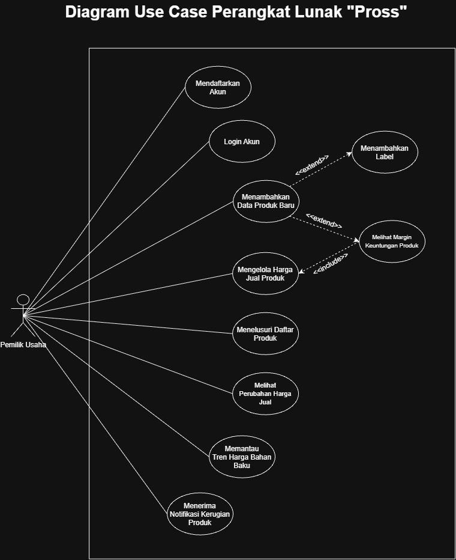

<i> Gambar 1. Use Case Diagram Perangkat Lunak Pross</i>

 

## 3.4 Skenario Use Case
Salin ulang skenario **setiap** use case (skenario normal dan alternatif) dari dokumen *Use Case & Scenario Use Case*. Skenario ini menjadi dasar penentuan atribut dan metode/operasi kelas pada BAB 4.

Pada bagian ini, Anda diperbolehkan untuk menyalin dari dokumen sebelumnya.

### 3.4.1 Skenario UC01

**Nama Use Case:** *Mendaftarkan Akun*

**Skenario Normal**

| No | Aksi Aktor | Reaksi Perangkat Lunak |
| :--- | :--- | :--- |
| 1 | *Pemiliki usaha membuka perangkat lunak* | *Sistem menampilkan halaman registrasi/login* |
| 2 | *Pemilik usaha memilih opsi registrasi* | *Sistem mengarahkan ke halaman pembuatan akun* |
| 3 | *Pemilik usaha mengisi seluruh data registrasi yang dibutuhkan dan melakukan konfirmasi dengan menekan tombol "Buat Akun"* | *Sistem menerima respons pembuatan okun, menyimpan data pengguna ke database, dan menampilkan halaman utama perangkat lunak* |

 

**Skenario Alternatif 1: Data Registrasi Belum Lengkap**

| No | Aksi Aktor | Reaksi Perangkat Lunak |
| :--- | :--- | :--- |
| 1 | *Pemiliki usaha membuka perangkat lunak* | *Sistem menampilkan halaman registrasi/login* |
| 2 | *Pemilik usaha memilih opsi registrasi* | *Sistem mengarahkan ke halaman pembuatan akun* |
| 3 | *Pemilik usaha mengisi data registrasi secara tidak lengkap dan melakukan konfirmasi dengan menekan tombol "Buat Akun"* | *Sistem mendeteksi adanya data yang belum diisi dan menampilkan pesan error "Data Registrasi Belum Lengkap". Sistem akan meminta pengguna untuk mengisi data registrasi hingga lengkap* |

 

**Skenario Alternatif 2: Akun yang Dibuat Sudah Terdaftar**

| No | Aksi Aktor | Reaksi Perangkat Lunak |
| :--- | :--- | :--- |
| 1 | *Pemiliki usaha membuka perangkat lunak* | *Sistem menampilkan halaman registrasi/login* |
| 2 | *Pemilik usaha memilih opsi registrasi* | *Sistem mengarahkan ke halaman pembuatan akun* |
| 3 | *Pemilik usaha mengisi seluruh data registrasi yang dibutuhkan dan melakukan konfirmasi dengan menekan tombol "Buat Akun"* | *Sistem mendeteksi bahwa data yang diinput sudah terdapat di database, menandakan bahwa akun sudah pernah dibuat. Sistem akan memberikan pesan "Akun sudah dibuat" dan mengembalikan pengguna pada halaman registrasi agar pengguna dapat mengganti data* |

 

**Skenario Alternatif 3: Password tidak memenuhi ketentuan yang diberikan**

| No | Aksi Aktor | Reaksi Perangkat Lunak |
| :--- | :--- | :--- |
| 1 | *Pemiliki usaha membuka perangkat lunak* | *Sistem menampilkan halaman registrasi/login* |
| 2 | *Pemilik usaha memilih opsi registrasi* | *Sistem mengarahkan ke halaman pembuatan akun* |
| 3 | *Pemilik usaha mengisi seluruh data registrasi yang dibutuhkan dan melakukan konfirmasi dengan menekan tombol "Buat Akun"* | *Sistem mendeteksi bahwa password yang diinput tidak sesuai dengan ketentuan dan memberikan pesan "Password terlalu lemah" dan mengembalikan pengguna pada halaman registrasi agar pengguna dapat memperbaiki password* |

 

### 3.4.2 Skenario UC02

**Nama Use Case:** *Login Dengan Akun yang Sudah Terdaftar*

**Skenario Normal**

| No | Aksi Aktor | Reaksi Perangkat Lunak |
| :--- | :--- | :--- |
| 1 | *Pemiliki usaha membuka perangkat lunak* | *Sistem menampilkan halaman registrasi/login* |
| 2 | *Pemilik usaha memilih opsi login* | *Sistem mengarahkan ke halaman login* |
| 3 | *Pemilik usaha mengisi username dan password dari akun yang ingin di login dengan tepat dan melakukan konfirmasi dengan menekan tombol "Login"* | *Sistem menerima respons data akun, memverifikasi data, dan menampilkan halaman utama perangkat lunak* |

 

**Skenario Alternatif 1: Username atau Password Tidak Sesuai**

| No | Aksi Aktor | Reaksi Perangkat Lunak |
| :--- | :--- | :--- |
| 1 | *Pemiliki usaha membuka perangkat lunak* | *Sistem menampilkan halaman registrasi/login* |
| 2 | *Pemilik usaha memilih opsi login* | *Sistem mengarahkan ke halaman login* |
| 3 | *Pemilik usaha mengisi username dan password dari akun yang ingin di login, tetapi salah satu atau keduanya tidak tepat dan melakukan konfirmasi dengan menekan tombol "Login"* | *Sistem menerima respons data akun, memverifikasi data, mendeteksi ketidaksesuaian, dan menampilkan pesan error "Username atau Password Salah"* |

 

**Skenario Alternatif 2: Akun Belum Dibuat**

| No | Aksi Aktor | Reaksi Perangkat Lunak |
| :--- | :--- | :--- |
| 1 | *Pemiliki usaha membuka perangkat lunak* | *Sistem menampilkan halaman registrasi/login* |
| 2 | *Pemilik usaha memilih opsi login* | *Sistem mengarahkan ke halaman login* |
| 3 | *Pemilik usaha mengisi username dan password dari akun yang belum pernah dibuat dan melakukan konfirmasi dengan menekan tombol "Login"* | *Sistem menerima respons data akun, memverifikasi data, gagal menemukan data, dan menampilkan pesan error "Tidak dapat menemukan akun"* |    

 

**Skenario Alternatif 3: Reset Password**

| No | Aksi Aktor | Reaksi Perangkat Lunak |
| :--- | :--- | :--- |
| 1 | *Pemiliki usaha membuka perangkat lunak* | *Sistem menampilkan halaman registrasi/login* |
| 2 | *Pemilik usaha memilih opsi login* | *Sistem mengarahkan ke halaman login* |
| 3 | *Pemilik usaha mengisi username dan password dari akun yang belum pernah dibuat dan melakukan konfirmasi dengan menekan tombol "Login"* | *Sistem menerima respons data akun, memverifikasi data, gagal mencocokan data pengguna, dan menampilkan pesan error "Username atau Password Salah"* |    
| 4 | *Pemilik usaha menekan tombol "Lupa Password* | *Sistem mengalihkan Pengguna menuju laman reset password* |
| 5 | *Pemilik usaha mengisi password baru* | *Sistem menyikpan data password baru yang telah diisi oleh pengguna* |    

 

### 3.4.3 Skenario UC03

**Nama Use Case:** *Menambahkan Data Produk Baru*

**Skenario Normal**

| No | Aksi Aktor | Reaksi Perangkat Lunak |
| :--- | :--- | :--- |
| 1 | *Pemilik usaha membuka halaman menu "Tambah Produk Baru"* | *Sistem menampilkan pop-up untuk menginput nama produk* |
| 2 | *Pemilik usaha menginput nama dari produk beserta tag (opsional) dan melakukan konfirmasi dengan menekan tombol "Ok"* | *Sistem menerima input nama produk, tag, memverifikasi nama, menyimpan nama dan tag ke database, dan menampilkan halaman menu "Tambah Produk Baru" yang melibatkan input bahan baku, takaran, dan harga jual* |
| 3 | *Pemilik usaha menginput bahan baku, takarannya, dan harga jualnya, lalu melakukan konfirmasi dengan menekan tombol "Kalkulasi" * | *Sistem menerima input data, dan menyimpannya di database* |

 

**Skenario Alternatif 1: Nama Produk Sudah Pernah Dibuat**

| No | Aksi Aktor | Reaksi Perangkat Lunak |
| :--- | :--- | :--- |
| 1 | *Pemilik usaha membuka halaman menu "Tambah Produk Baru"* | *Sistem menampilkan pop-up untuk menginput nama produk* |
| 2 | *Pemilik usaha menginput nama dari produk yang sudah pernah dibuat beserta tag (opsional) dan melakukan konfirmasi dengan menekan tombol "Ok"* | *Sistem menerima input nama produk, memverifikasi nama, mendeteksi bahwa nama produk sudah terdapat di database, dan memberikan pesan error "Nama Produk Sudah Pernah Dibuat". Sistem akan mengembalikan pengguna pada halaman input nama produk dan tag* |

 

**Skenario Alternatif 2: Input Jumlah Takaran atau Harga Jual Invalid**

| No | Aksi Aktor | Reaksi Perangkat Lunak |
| :--- | :--- | :--- |
| 1 | *Pemilik usaha membuka halaman menu "Tambah Produk Baru"* | *Sistem menampilkan pop-up untuk menginput nama produk* |
| 2 | *Pemilik usaha menginput nama dari produk beserta tag (opsional) dan melakukan konfirmasi dengan menekan tombol "Ok"* | *Sistem menerima input nama produk, memverifikasi nama, menyimpan namanya ke database, dan menampilkan halaman menu "Tambah Produk Baru" yang melibatkan input bahan baku, takaran, dan harga jual* |
| 3 | *Pemilik usaha menginput bahan baku, takarannya, dan harga jualnya, tetapi nilainya invalid, lalu melakukan konfirmasi dengan menekan tombol "Kalkulasi" * | *Sistem menerima input data, mendeteksi nilai yang invalid, lalu memberikan pesan error "Input Takaran / Harga Jual Tidak Valid" dan mengembalikan pengguna pada halaman "Tambah Produk Baru"* |

 

### 3.4.4 Skenario UC04

**Nama Use Case:** *Melihat Margin Keuntungan Produk*

**Skenario Normal**

| No | Aksi Aktor | Reaksi Perangkat Lunak |
| :--- | :--- | :--- |
| 1 | *Setelah konfirmasi, pemilik usaha akan melihat perbandingan nilai harga jual yang ditetapkan dengan harga standar berdasarkan bahan baku* | *Sistem melakukan perbandingan terhadap harga jual dan harga standar, menemukan bahwa margin bernilai positif, lalu menampilkan data harga dan margin* |
| 2 | *Pemilik usaha melakukan konfirmasi setelah melihat margin yang bernilai positif dengan menekan tombol "Selesai"* | *Sistem mengembalikan pengguna ke halaman utama* |

 

**Skenario Alternatif 1: Harga Jual yang Ditetapkan Rugi**

| No | Aksi Aktor | Reaksi Perangkat Lunak |
| :--- | :--- | :--- |
| 1 | *Setelah konfirmasi, pemilik usaha akan melihat perbandingan nilai harga jual yang ditetapkan dengan harga standar berdasarkan bahan baku* | *Sistem melakukan perbandingan terhadap harga jual dan harga standar, menemukan bahwa margin bernilai negatif, lalu menampilkan data hargam margin, dan pesan "Harga Jual yang Ditetapkan Memiliki Margin Negatif". Sistem akan meminta pengguna untuk mengganti harga jual* |
| 2 | *Pemilik usaha melakukan perbaikan terhadap nilai harga jual dan melakukan konfirmasi ulang.* | *Sistem melakukan perbandingan terhadap harga jual baru dan harga standar, menemukan bahwa margin bernilai positif, lalu menampilkan data harga dan margin* |
| 3 | *Pemilik usaha melakukan konfirmasi setelah melihat margin yang bernilai positif dengan menekan tombol "Selesai"* | *Sistem mengembalikan pengguna ke halaman utama* |

 

### 3.4.5 Skenario UC05

**Nama Use Case:** *Mengelola Harga Jual Produk*

**Skenario Normal**

| No | Aksi Aktor | Reaksi Perangkat Lunak |
| :--- | :--- | :--- |
| 1 | *Pemilik usaha memilih produk yang ingin diedit harga jualnya* | *Sistem menampilkan form edit untuk produk yang dipilih* |
| 2 | *Pemilik usaha mengetikkan dan menyimpan harga jual produk yang baru* | *Sistem memvalidasi dan menyimpan harga jual produk yang baru kedalam database lalu menampilkan pesan "Berhasil Diedit"* |

 

**Skenario Alternatif 1: Input Bukan Merupakan Bilangan Positif**
| No | Aksi Aktor | Reaksi Perangkat Lunak |
| :--- | :--- | :--- |
| 1 | *Pemilik usaha memilih produk yang ingin diedit harga jualnya* | *Sistem menampilkan form edit untuk produk yang dipilih* |
| 2 | *Pemilik usaha mengetikkan dan menyimpan harga jual produk yang baru namun bukan merupakan bilangan positif* | *Sistem memvalidasi namun tidak berhasil menyimpan harga jual produk yang baru kedalam database lalu menampilkan pesan "Masukkan bilangan positif"* |

### 3.4.6 Skenario UC06

**Nama Use Case:** *Menelusuri Daftar Produk*

**Skenario Normal**

| No | Aksi Aktor | Reaksi Perangkat Lunak |
| :--- | :--- | :--- |
| 1 | *Pemilik Usaha mengetik keyword nama atau tag yang ingin dicari* | *Sistem mencari semua produk dengan nama atau tag yang relevan* |
| 2 | *Pemilik Usaha menekan tombol search* | *Sistem menampilkan semua produk dengan nama atau tag yang diinput* |

 

**Skenario Alternatif 1: Produk tidak ditemukan**

| No | Aksi Aktor | Reaksi Perangkat Lunak |
| :--- | :--- | :--- |
| 1 | *Pemilik Usaha memilih nama atau tag yang ingin dicari* | *Sistem mencari semua produk dengan nama atau tag yang relevan* |
| 2 | *Pemilik Usaha menekan tombol search* | *Sistem tidak dapat menampilkan produk dengan nama atau tag yang diinput dan menampilkan pesan "Tidak ada produk yang relevan"* |

### 3.4.7 Skenario UC07

**Nama Use Case:** *Melihat Perubahan Harga Jual*

**Skenario Normal**

| No | Aksi Aktor | Reaksi Perangkat Lunak |
| :--- | :--- | :--- |
| 1 | *Pemilik Usaha memilih suatu produk spesifik dari daftar produk.* | *Sistem menampilkan halaman detail dari produk yang dipilih.* |
| 2 | *Pemilik Usaha menekan tombol atau tab "Riwayat Harga".* | *Sistem mengambil data historis dari database dan menampilkan daftar urutan perubahan harga jual produk tersebut beserta tanggal perubahannya.* |

 

**Skenario Alternatif 1: Belum Ada Data Historis**

| No | Aksi Aktor | Reaksi Perangkat Lunak |
| :--- | :--- | :--- |
| 1 | *Pemilik Usaha memilih suatu produk spesifik dari daftar produk.* | *Sistem menampilkan halaman detail dari produk yang dipilih.* |
| 2 | *Pemilik Usaha menekan tombol atau tab "Riwayat Harga".* | *Sistem mendeteksi bahwa produk belum pernah mengalami perubahan harga jual sejak pertama kali dibuat dan menampilkan pesan "Belum ada riwayat perubahan harga untuk produk ini".* |

 

### 3.4.8 Skenario UC08

**Nama Use Case:** *Memantau Tren Harga Bahan Baku*

**Skenario Normal**

| No | Aksi Aktor | Reaksi Perangkat Lunak |
| :--- | :--- | :--- |
| 1 | *Pemilik Usaha membuka halaman menu "Tren Bahan Baku".* | *Sistem memuat dan menampilkan daftar seluruh bahan baku yang pernah diinput ke dalam sistem.* |
| 2 | *Pemilik Usaha memilih salah satu bahan baku.* | *Sistem mengumpulkan data historis harga dari bahan baku tersebut dan mengonversinya menjadi visualisasi grafik tren harga.* |
| 3 | *Pemilik Usaha mengubah rentang waktu pada grafik.* | *Sistem memuat ulang grafik dan memperbarui tampilan visual sesuai dengan rentang waktu yang dipilih.* |

 

**Skenario Alternatif 1: Data Tidak Memenuhi Syarat Grafik**

| No | Aksi Aktor | Reaksi Perangkat Lunak |
| :--- | :--- | :--- |
| 1 | *Pemilik Usaha membuka halaman menu "Tren Bahan Baku".* | *Sistem memuat dan menampilkan daftar seluruh bahan baku.* |
| 2 | *Pemilik Usaha memilih bahan baku yang baru saja ditambahkan.* | *Sistem mendeteksi bahwa jumlah titik data belum cukup untuk membentuk grafik dan menampilkan pesan "Data belum cukup untuk memvisualisasikan grafik tren harga".* |

 

**Skenario Alternatif 2: Bahan Baku Belum Pernah Mengalami Pembaruan Harga**

| No | Aksi Aktor | Reaksi Perangkat Lunak |
| :--- | :--- | :--- |
| 1 | *Pemilik Usaha membuka halaman menu "Tren Bahan Baku".* | *Sistem memuat dan menampilkan daftar seluruh bahan baku.* |
| 2 | *Pemilik Usaha memilih bahan baku yang harganya belum pernah diperbarui sejak pertama didaftarkan.* | *Sistem menampilkan harga saat ini berupa teks nominal tanpa memuat grafik garis, disertai keterangan "Belum ada riwayat fluktuasi harga untuk bahan baku ini".* |

### 3.4.9 Skenario UC09

**Nama Use Case:** *Menerima Notifikasi Kerugian Produk*

**Skenario Normal**

| No | Aksi Aktor | Reaksi Perangkat Lunak |
| :--- | :--- | :--- |
| 1 | *Pemilik Usaha memperbarui harga beli bahan baku yang mengalami kenaikan.* | *Sistem menyimpan harga baru, melakukan kalkulasi HPP ulang, dan mendeteksi bahwa ada produk yang margin keuntungannya bernilai negatif.* |
| 2 | *Pemilik Usaha menutup aplikasi atau berpindah halaman.* | *Sistem memicu dan mengirimkan push notification ke perangkat Pemilik Usaha yang berisi nama produk yang terdampak.* |
| 3 | *Pemilik Usaha menekan push notification tersebut pada layar smartphone.* | *Sistem membuka aplikasi dan langsung mengarahkan pengguna ke halaman detail produk yang merugi tersebut.* |

 

**Skenario Alternatif 1: Pemilik Usaha Mengabaikan Push Notification**

| No | Aksi Aktor | Reaksi Perangkat Lunak |
| :--- | :--- | :--- |
| 1 | *Pemilik Usaha memperbarui harga beli bahan baku yang mengalami kenaikan.* | *Sistem memproses kenaikan harga, mendeteksi kerugian, dan mengirimkan push notification.* |
| 2 | *Pemilik Usaha mengabaikan atau menghapus (swipe) notifikasi tersebut dari layar.* | *Sistem tetap menyematkan label peringatan visual (ikon alert merah) pada produk yang bersangkutan di database UI.* |
| 3 | *Pemilik Usaha membuka halaman Daftar Produk secara manual.* | *Sistem menampilkan daftar produk beserta ikon peringatan kerugian yang masih aktif pada produk yang terdampak.* |

 

### 3.4.10 Skenario UC10

**Nama Use Case:** *Menerima Notifikasi Perubahan Harga Bahan Baku*

**Skenario Normal**

| No | Aksi Aktor | Reaksi Perangkat Lunak |
| :--- | :--- | :--- |
| 1 | *Pemilik Usaha memperbarui harga jual bahan baku yang mengalami kenaikan.* | *Sistem menyimpan harga baru, melakukan kalkulasi HPP ulang, dan mendeteksi bahwa ada produk yang margin keuntungannya bernilai negatif.* |
| 2 | *Pemilik Usaha menutup aplikasi atau berpindah halaman.* | *Sistem memicu dan mengirimkan push notification ke perangkat Pemilik Usaha yang berisi nama produk yang terdampak.* |
| 3 | *Pemilik Usaha menekan push notification tersebut pada layar smartphone.* | *Sistem membuka aplikasi dan langsung mengarahkan pengguna ke halaman utama.* |

 

**Skenario Alternatif 1: Pemilik Usaha Mengabaikan Push Notification**

| No | Aksi Aktor | Reaksi Perangkat Lunak |
| :--- | :--- | :--- |
| 1 | *Pemilik Usaha memperbarui harga jual bahan baku yang mengalami kenaikan.* | *Sistem memproses kenaikan harga, mendeteksi kerugian, dan mengirimkan push notification.* |
| 2 | *Pemilik Usaha mengabaikan atau menghapus (swipe) notifikasi tersebut dari layar.* | *Sistem menyimpan notifikasi perubahan harga jual pada menu notifikasi dalam perangkat lunak* |
| 3 | *Pemilik Usaha menekan menu notifikasi pada halaman utama.* | *Sistem menampilkan list notifikasi pada menu notifikasi.* |

### 3.4.11 Skenario UC11

**Nama Use Case:** *Mengubah Data Akun*

**Skenario Normal**

| No | Aksi Aktor | Reaksi Perangkat Lunak |
| :--- | :--- | :--- |
| 1 | *Pemilik Usaha menekan tombol "Profile" pada aplikasi.* | *Sistem mengalihkan pengguna menuju halaman "Profile".* |
| 2 | *Pemilik Usaha mengubah data pada akun Pemilik Usaha dan menekan tombol "Change".* | *Sistem memperbarui data milik Pemilik Usaha pada database.* |

 

### 3.4.12 Skenario UC12

**Nama Use Case:** *Keluar dari Akun*

**Skenario Normal**

| No | Aksi Aktor | Reaksi Perangkat Lunak |
| :--- | :--- | :--- |
| 1 | *Pemilik Usaha menekan tombol "Profile" pada aplikasi.* | *Sistem mengalihkan pengguna menuju halaman "Profile".* |
| 2 | *Pemilik Usaha menekan tombol "Logout" pada halaman "Profile".* | *Sistem menampilkan pop-up "Konfirmasi Logout".* |
| 2 | *Pemilik Usaha menekan tombol "Ya" pada pop-up "Konfirmasi Logout".* | *Sistem mengalihkan pengguna menuju halaman "Login" kembali setelah Pengguna menekan tombol "Logout".* |

 

**Skenario Alternatif 1: Pemilik Usaha Menekan Tombol "Tidak"**

| No | Aksi Aktor | Reaksi Perangkat Lunak |
| :--- | :--- | :--- |
| 1 | *Pemilik Usaha menekan tombol "Profile" pada aplikasi.* | *Sistem mengalihkan pengguna menuju halaman "Profile".* |
| 2 | *Pemilik Usaha menekan tombol "Logout" pada halaman "Profile".* | *Sistem menampilkan pop-up "Konfirmasi Logout".* |
| 2 | *Pemilik Usaha menekan tombol "Tidak" pada pop-up "Konfirmasi Logout".* | *Sistem mengembalikan tampilan aplikasi menjadi halaman "Profile" kembali.* |

---

# BAB 4: Diagram Kelas
Bagian ini berisi identifikasi kelas dan pemodelan struktur kelas yang diperlukan untuk merealisasikan use case pada BAB 3. Gunakan skenario use case (3.4) sebagai dasar untuk menentukan kelas, atribut, metode, dan hubungan antarkelas.

## 4.1 Identifikasi Kelas
Identifikasi seluruh kelas yang diperlukan berdasarkan use case dan skenarionya. Satu kelas boleh terkait dengan lebih dari satu use case.

| ID Kelas | Nama Kelas | Deskripsi Kelas | ID Use Case |
| :--- | :--- | :--- | :--- |
| *C01* | *PemilikUsaha* | *Menyimpan seluruh data milik akun pemilik usaha berupa username, email, password, dan hal yang berkaitan dengan produk pemilik usaha (Entity Class).* | *UC01, UC02, UC03, UC04, UC05, UC06, UC07, UC08, UC09, UC10, UC11, UC12* |
| *C02* | *Produk* | *Menyimpan data produk berupa nama, harga jual, margin, dan tag yang dikelola oleh pemilik usaha (Entity Class).* | *UC03, UC04, UC05, UC06, UC07, UC09, UC10* |
| *C03* | *BahanBaku* | *Menyimpan data harga beli bahan baku yang digunakan sebagai resep produk (Entity Class).* | *UC03, UC04, UC08, UC09, UC10* |
| *C04* | *ResepBahan* | *Menyimpan takaran bahan baku yang digunakan dalam suatu produk (Entity Class).* | *UC03, UC04* |
| *C05* | *RegistrationPage* | *Antarmuka untuk menerima input data Username, Email dan Password pemilik usaha serta tombol "Buat Akun" untuk mendaftarkan akun pemilik usaha ke dalam database milik perangkat lunak (Boundary Class).* | *UC01* |
| *C06* | *AuthController* | *Memastikan bahwa input yang dilakukan oleh pemilik usaha pada halaman registrasi dan halaman login sudah sesuai dengan data yang dimiliki oleh perangkat lunak (Controller).* | *UC01, UC02* |
| *C07* | *LoginPage* | *Antarmuka untuk menerima input data Username/Email dan Password pemilik usaha serta tombol "Login" (Boundary Class).* | *UC02* |
| *C08* | *ResetPasswordPage* | *Antarmuka untuk menerima input berupa password baru yang dibuat oleh user dan merupakan password yang berbeda dengan password lama (Boundary Class).* | *UC02* |
| *C09* | *ResetPasswordController* | *Mengatur seluruh keberjalanan dari proses riset password mulai dari input, verifikasi akun, serta memperbarui password user (Controller Class).* | *UC02* |
| *C10* | *AddProductPage* | *Antarmuka untuk menerima input data produk dan menampilkan hasil kalkulasi secara real time (Boundary Class).* | *UC03, UC04* |
| *C11* | *MarginController* | *Menghitung perbedaan harga jual dan harga standar untuk menghasilkan margin yang untung/rugi (Controller Class).* | *UC03, UC04* |
| *C12* | *EditProductPage* | *Antarmuka untuk meginput data harga jual baru (Boundary Class).* | *UC05* |
| *C13* | *PriceController* | *Memvalidasi input, baik positif maupun negatif, memproses perubahan, dan menciptakan history (Controller Class).* | *UC05, UC07* |
| *C14* | *RiwayatHargaBahanBaku* | *Menyimpan data entitas catatan fluktuasi harga beli bahan baku beserta waktu perubahannya (Entity Class).* | *UC08* |
| *C15* | *TrenBahanBakuPage* | *Antarmuka yang menampilkan daftar bahan baku, rentang waktu, dan memvisualisasikan grafik tren (Boundary Class).* | *UC08* |
| *C16* | *TrendController* | *Mengambil data riwayat harga dari database, menerapkan filter waktu, dan mengonversinya menjadi format grafik (Controller Class).* | *UC08* |
| *C17* | *Notifikasi* | *Menyimpan detail pesan peringatan kerugian, waktu dikirim, dan status keterbacaan (Entity Class).* | *UC09, UC10* |
| *C18* | *PushNotificationUI* | *Antarmuka notifikasi sistem operasi (OS) yang muncul di perangkat pengguna (Boundary Class).* | *UC09, UC10* |
| *C19* | *NotificationController* | *Mendeteksi hasil margin negatif setelah pembaruan harga, membuat objek notifikasi, dan memicu pengiriman pesan (Controller Class).* | *UC09, UC10* |
| *C20* | *RiwayatHargaJual* | *Menyimpan data entitas catatan harga jual lama dari produk sebelum nilainya diperbarui (Entity Class).* | *UC05, UC07* |
| *C21* | *SearchProductPage* | *Antarmuka untuk menerima input kata kunci/tag pencarian dari pengguna dan menampilkan daftar produk hasil pencarian (Boundary Class).* | *UC06* |
| *C22* | *ProductSearchController* | *Memproses kata kunci/tag yang diinput dan melakukan pencocokan (filtering) terhadap data produk untuk menghasilkan daftar produk yang relevan (Controller Class).* | *UC06* |
| *C23* | *PriceHistoryPage* | *Antarmuka untuk menampilkan data/grafik historis perubahan harga jual suatu produk (Boundary Class).* | *UC07* |
| *C24* | *PriceHistoryController* | *Mengambil data riwayat harga dari database dan menyusunnya menjadi format yang dapat ditampilkan (Controller Class).* | *UC07* |
| *C25* | *ProfilePage* | *Antarmuka untuk menampilkan dan menerima input perubahan data profil (nama usaha, email, password, no telepon), serta menyediakan tombol untuk proses logout (Boundary Class).* | *UC11, UC12* |
| *C26* | *Profile Controller* | *Mengelola logika untuk memvalidasi dan menyimpan perubahan data akun ke database, serta menangani proses pengakhiran sesi saat pengguna melakukan logout (Controller Class).* | *UC11, UC12* |

## 4.2 Diagram Kelas per Use Case

### 4.2.1 Use Case UC01

**Nama Use Case:** *Mendaftarkan Akun*

#### Identifikasi Kelas

| ID Kelas | Nama Kelas | Deskripsi Kelas |
| :--- | :--- | :--- |
| *C01* | *PemilikUsaha* | *Menyimpan data entitas akun pemilik usaha yang sedang membuat produk baru (Entity Class).* |
| *C05* | *RegistrationPage* | *Antarmuka untuk menerima input data Username, Email dan Password pemilik usaha serta tombol "Buat Akun" untuk mendaftarkan akun pemilik usaha ke dalam database milik perangkat lunak (Boundary Class).* |
| *C06* | *AuthController* | *Memastikan bahwa input yang dilakukan oleh pemilik usaha sudah sesuai dengan data milik perangkat lunak (Controller).* |

#### Diagram Kelas

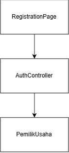

<i>Gambar 2. Diagram Kelas Use Case UC01</i>

 

| ID Kelas | Nama Kelas | Atribut | Metode/Operasi |
| :--- | :--- | :--- | :--- |
| *C01* | *PemilikUsaha* | *username, email, password* | *createUser()* |
| *C05* | *RegistrationPage* | *usernameInput, emailInput, passwordInput,* | *submitForm(), displaySuccess(), displayError()* |
| *C06* | *AuthController* | *-* | *validateData()* |

### 4.2.2 Use Case UC02

**Nama Use Case:** *Login dengan akun yang sudah terdaftar*

#### Identifikasi Kelas

| ID Kelas | Nama Kelas | Deskripsi Kelas |
| :--- | :--- | :--- |
| *C01* | *PemilikUsaha* | *Menyimpan data entitas akun pemilik usaha yang sedang membuat produk baru (Entity Class).* |
| *C07* | *LoginPage* | *Antarmuka untuk menerima input data Username/Email dan Password pemilik usaha serta tombol "Login" (Boundary Class).* |
| *C06* | *AuthController* | *Memastikan bahwa input yang dilakukan oleh pemilik usaha sudah sesuai dengan data milik perangkat lunak (Controller).* |
| *C08* | *ResetPasswordPage* | *Antarmuka untuk melakukan perubahan password akun (Boundary Class).* |
| *C09* | *ResetPasswordController* | *Verifikasi password baru yang benar dan sesuai dengan ketentuan (Controller).* |

#### Diagram Kelas

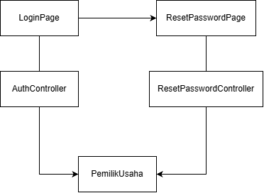

<i>Gambar 3. Diagram Kelas Use Case UC01</i>

 

| ID Kelas | Nama Kelas | Atribut | Metode/Operasi |
| :--- | :--- | :--- | :--- |
| *C01* | *PemilikUsaha* | *username, email, password* | *getUsername(), getEmail(), getPassword(), setPassword()* |
| *C07* | *LoginPage* | *usernameInput, passwordInput,* | *login(), navigateToResetPassword(), displayError()* |
| *C06* | *AuthController* | *-* | *validateData()* |
| *C08* | *ResetPasswordPage* | *emailInput, newPasswordInput, confirmNewPassword* | *submitResetRequest(), submitNewPassword(), displayError(), displaySuccess()* |
| *C09* | *ResetPasswordController* | *-* | *validateData(), resetPassword()* |

### 4.2.3 Use Case UC03

**Nama Use Case:** *Menambahkan Data Produk Baru*

#### Identifikasi Kelas

| ID Kelas | Nama Kelas | Deskripsi Kelas |
| :--- | :--- | :--- |
| *C01* | *PemilikUsaha* | *Menyimpan data entitas akun pemilik usaha yang sedang menambahkan produk baru (Entity Class).* |
| *C02* | *Produk* | *Menyimpan data entitas produk baru yang diinput oleh pengguna, meliputi nama, tag, harga jual, dan margin (Entity Class).* |
| *C03* | *BahanBaku* | *Menyimpan data entitas bahan baku yang dipilih pengguna sebagai komposisi resep produk (Entity Class).* |
| *C04* | *ResepBahan* | *Menyimpan data entitas takaran spesifik dari bahan baku yang digunakan untuk menyusun resep suatu produk (Entity Class).* |
| *C10* | *AddProductPage* | *Antarmuka untuk menerima input data produk baru, bahan baku, takaran, harga jual, serta menampilkan hasil kalkulasi (Boundary Class).* |
| *C11* | *MarginController* | *Memvalidasi nama produk, memeriksa input takaran/harga jual, memproses kalkulasi margin, serta menyimpan data produk dan resep ke database (Controller Class).* |

#### Diagram Kelas

  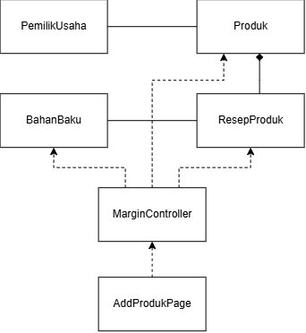

  <i>Gambar 4. Diagram Kelas Use Case UC03</i>

| ID Kelas | Nama Kelas | Atribut | Metode/Operasi |
| :--- | :--- | :--- | :--- |
| *C01* | *PemilikUsaha* | *username, password* | *getUsername(), getPassword()* |
| *C02* | *Produk* | *namaProduk, tag, hargaJual, margin* | *getNamaProduk(), setNamaProduk(), getTag(), setTag(), setHargaJual(), setMargin(), getMargin()* |
| *C03* | *BahanBaku* | *namaBahan, hargaBeli* | *getNamaBahan(), getHargaBeli()* |
| *C04* | *ResepBahan* | *takaran* | *getTakaran(), setTakaran()* |
| *C10* | *AddProductPage* | *inputNamaProduk, inputTag, inputTakaran, inputHargaJual* | *showPage(), getInput(), showErrorMessage(), showSuccessMessage()* |
| *C11* | *MarginController* | *currentProduk, currentResep* | *validasiNamaProduk(), validasiInput(), simpanProdukBaru(), simpanResep()* |

### 4.2.4 Use Case UC04

**Nama Use Case:** *Melihat Margin Keuntungan Produk*

#### Identifikasi Kelas

| ID Kelas | Nama Kelas | Deskripsi Kelas |
| :--- | :--- | :--- |
| *C01* | *PemilikUsaha* | *Menyimpan data entitas akun pemilik usaha yang sedang membuat produk baru (Entity Class).* |
| *C03* | *BahanBaku* | *Menyediakan data referensi berupa informasi harga beli standar bahan dari pasar, yang diperlukan oleh sistem untuk mengalkulasi harga jual standar (Entity Class).* |
| *C02* | *Produk* | *Menyimpan data entitas produk yang sedang diinput oleh pengguna, meliputi informasi nama, tag, harga jual yang ditetapkan, serta nilai akhir marginnya. (Entity Class).* |
| *C04* | *ResepBahan* | *Menyimpan data jumlah takaran spesifik untuk tiap bahan baku yang diinput oleh pengguna untuk menyusun resep dari produk tersebut. (Entity Class).* |
| *C10* | *AddProductPage* | *Antarmuka untuk menerima input data produk dan menampilkan hasil kalkulasi secara real time (Boundary Class).* |
| *C11* | *MarginController* | *Menghitung perbedaan harga jual dan harga standar untuk menghasilkan margin yang untung/rugi (Controller Class).* |

#### Diagram Kelas

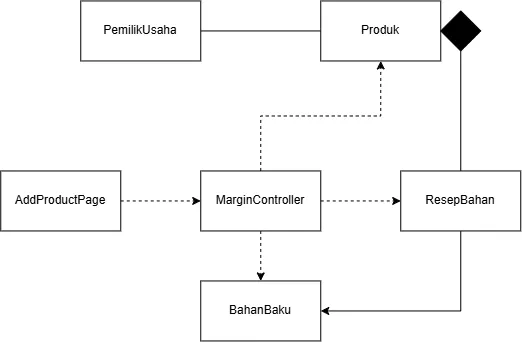

<i>Gambar 5. Diagram Kelas Use Case UC04</i>

 

| ID Kelas | Nama Kelas | Atribut | Metode/Operasi |
| :--- | :--- | :--- | :--- |
| *C01* | *PemilikUsaha* | *username, password* | *getUsername(),  getPassword()* |
| *C03* | *BahanBaku* | *namaBahan, hargaBeli* | *getNamaBahan(), getHargaBeli()* |
| *C02* | *Produk* | *nama, tag, hargaJual, margin* | *getNama(), setNama(), getTag(), setTag(), setHargaJual(), setMargin(), getMargin()* |
| *C04* | *ResepBahan* | *takaran* | *getTakaran(), setTakaran()* |
| *C010* | *AddProductPage* | *namaInput, tagInput, bahanBakuInput, takaranInput, hargaInput* | *showPage(), getInput(), showError(), showMargin()* |
| *C011* | *MarginController* | *currentPemilik, currentProduk* | *hitungMargin(), simpanProduk()* |

### 4.2.5 Use Case UC05

**Nama Use Case:** *Mengelola Harga Jual Produk*

#### Identifikasi Kelas

| ID Kelas | Nama Kelas | Deskripsi Kelas |
| :--- | :--- | :--- |
| *C01* | *PemilikUsaha* | *Menyimpan data entitas akun pemilik usaha yang sedang mengubah harga produk (Entity Class).* |
| *C02* | *Produk* | *Menyimpan data entitas produk yang sedang diubah nilai harganya (Entity Class).* |
| *C20* | *RiwayatHargaJual* | *Menyimpan data entitas catatan harga jual lama dari produk sebelum nilainya diperbarui (Entity Class).* |
| *C12* | *EditProductPage* | *Antarmuka untuk meginput data harga jual baru (Boundary Class).* |
| *C13* | *PriceController* | *Memvalidasi input, baik positif maupun negatif, memproses perubahan, dan menciptakan history (Controller Class).* |

#### Diagram Kelas

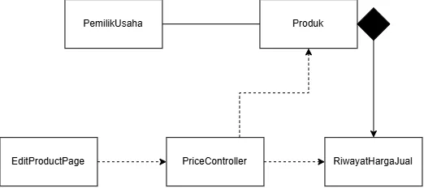

<i>Gambar 6. Diagram Kelas Use Case UC05</i>

 

| ID Kelas | Nama Kelas | Atribut | Metode/Operasi |
| :--- | :--- | :--- | :--- |
| *C01* | *PemilikUsaha* | *username, password* | *getUsername(),  getPassword()* |
| *C02* | *Produk* | *nama, hargaJual, margin* | *getNama(), setNama(), setHargaJual(), setMargin(), getMargin()* |
| *C20* | *RiwayatHargaJual* | *hargaJualama, waktuPerubahan* | *setHargaJualLama(), setWaktuPerubahan(), getWaktuPerubahan()* |
| *C12* | *EditProductPage* | *hargaBaruInput* | *showPage(), getInput(), showSuccessMessage(), showErrorMessage()* |
| *C13* | *PriceController* | *currentPemilik, currentProduk* | *validasiInput(), updateHargaProduk(), catatRiwayat()* |

### 4.2.6 Use Case UC06

**Nama Use Case:** *Menelusuri Daftar Produk*

#### Identifikasi Kelas

| ID Kelas | Nama Kelas | Deskripsi Kelas |
| :--- | :---` | :--- |
| *C01* | *PemilikUsaha* | *Menyimpan data entitas akun pemilik usaha yang sedang menelusuri daftar produknya (Entity Class).* |
| *C02* | *Produk* | *Menyimpan data entitas produk, meliputi nama, tag, harga jual, dan margin, yang menjadi target pencarian (Entity Class).* |
| *C21* | *SearchProductPage* | *Antarmuka untuk menerima input kata kunci/tag pencarian dari pengguna dan menampilkan daftar produk hasil pencarian (Boundary Class).* |
| *C22* | *ProductSearchController* | *Memproses kata kunci/tag yang diinput dan melakukan pencocokan (filtering) terhadap data produk untuk menghasilkan daftar produk yang relevan (Controller Class).* |

#### Diagram Kelas

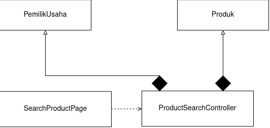

<i>Gambar 7. Diagram Kelas Use Case UC06</i>

| ID Kelas | Nama Kelas | Atribut | Metode/Operasi |
| :--- | :--- | :--- | :--- |
| *C01* | *PemilikUsaha* | *username, password* | *getUsername(), getPassword()* |
| *C02* | *Produk* | *namaProduk, tag, hargaJual, margin* | *getNamaProduk(), getTag(), getHargaJual(), getMargin()* |
| *C21* | *SearchProductPage* | *kataKunciPencarian, hasilPencarian* | *showPage(), showResults(), showErrorMessage()* |
| *C22* | *ProductSearchController* | *currentPemilik, kataKunci* | *searchProduk(), filterByTag()* |

---

### 4.2.7 Use Case UC07

**Nama Use Case:** *Melihat Perubahan Harga Jual*

#### Identifikasi Kelas

| ID Kelas | Nama Kelas | Deskripsi Kelas |
| :--- | :--- | :--- |
| *C01* | *PemilikUsaha* | *Menyimpan data entitas akun pemilik usaha yang sedang melihat riwayat perubahan harga jual produknya (Entity Class).* |
| *C02* | *Produk* | *Menyimpan data entitas produk yang harga jualnya ingin ditelusuri riwayat perubahannya (Entity Class).* |
| *C20* | *RiwayatHargaJual* | *Menyimpan data entitas catatan perubahan harga jual suatu produk beserta waktu perubahannya (Entity Class).* |
| *C23* | *PriceHistoryPage* | *Antarmuka untuk menampilkan data/grafik historis perubahan harga jual suatu produk (Boundary Class).* |
| *C24* | *PriceHistoryController* | *Mengambil data riwayat harga dari database dan menyusunnya menjadi format yang dapat ditampilkan (Controller Class).* |

#### Diagram Kelas

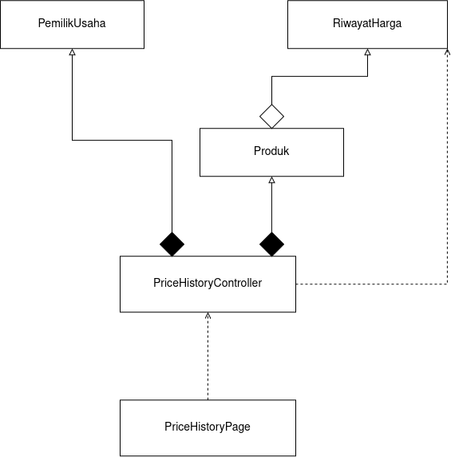

<i>Gambar 8. Diagram Kelas Use Case UC07</i>

| ID Kelas | Nama Kelas | Atribut | Metode/Operasi |
| :--- | :--- | :--- | :--- |
| *C01* | *PemilikUsaha* | *username, password* | *getUsername(), getPassword()* |
| *C02* | *Produk* | *namaProduk, hargaJualSaatIni* | *getNamaProduk(), getHargaJualSaatIni()* |
| *C20* | *RiwayatHargaJual* | *hargaLama, hargaBaru, waktuPerubahan* | *getHargaLama(), getHargaBaru(), getWaktuPerubahan()* |
| *C23* | *PriceHistoryPage* | *produkTerpilih, rentangWaktuFilter* | *showPage(), showChart(), showErrorMessage()* |
| *C24* | *PriceHistoryController* | *currentPemilik, currentProduk* | *getRiwayatHarga(), filterDataByDate(), generateChartData()* |

### 4.2.8 Use Case UC08

**Nama Use Case:** *Memantau Tren Harga Bahan Baku*

#### Identifikasi Kelas

| ID Kelas | Nama Kelas | Deskripsi Kelas |
| :--- | :--- | :--- |
| *C01* | *PemilikUsaha* | *Menyimpan data entitas akun pemilik usaha yang sedang memantau tren harga (Entity Class).* |
| *C03* | *BahanBaku* | *Menyimpan data entitas bahan baku yang akan dilihat riwayat perubahannya (Entity Class).* |
| *C14* | *RiwayatHargaBahanBaku* | *Menyimpan data entitas catatan fluktuasi harga beli bahan baku beserta waktu perubahannya (Entity Class).* |
| *C15* | *TrenBahanBakuPage* | *Antarmuka yang menampilkan daftar bahan baku, rentang waktu, dan memvisualisasikan grafik tren (Boundary Class).* |
| *C16* | *TrendController* | *Mengambil data riwayat harga dari database, menerapkan filter waktu, dan mengonversinya menjadi format grafik (Controller Class).* |

#### Diagram Kelas

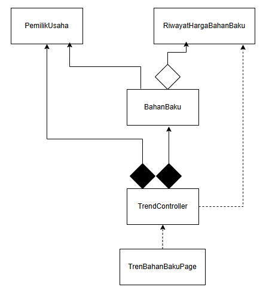

<i>Gambar 9. Diagram Kelas Use Case UC09</i>

| ID Kelas | Nama Kelas | Atribut | Metode/Operasi |
| :--- | :--- | :--- | :--- |
| *C01* | *PemilikUsaha* | *username, password* | *getUsername(), getPassword()* |
| *C03* | *BahanBaku* | *namaBahan, hargaBeli* | *getNamaBahan(), getHargaBeli()* |
| *C14* | *RiwayatHargaBahanBaku* | *hargaBeliLama, waktuPerubahan* | *getHargaBeliLama(), getWaktuPerubahan()* |
| *C15* | *TrenBahanBakuPage* | *bahanBakuTerpilih, rentangWaktuFilter* | *showPage(), showChart(), showErrorMessage()* |
| *C16* | *TrendController* | *currentPemilik, currentBahanBaku* | *getRiwayatHarga(), filterDataByDate(), generateChartData()* |

### 4.2.9 Use Case UC09

**Nama Use Case:** *Menerima Notifikasi Kerugian Produk*

#### Identifikasi Kelas

| ID Kelas | Nama Kelas | Deskripsi Kelas |
| :--- | :--- | :--- |
| *C01* | *PemilikUsaha* | *Menyimpan data entitas akun pemilik usaha yang menjadi target penerima notifikasi (Entity Class).* |
| *C02* | *Produk* | *Menyimpan data entitas produk yang terdampak kerugian, termasuk status peringatan aktifnya (Entity Class).* |
| *C03* | *BahanBaku* | *Menyimpan data bahan baku yang mengalami pembaruan harga beli sehingga memicu kalkulasi ulang (Entity Class).* |
| *C17* | *Notifikasi* | *Menyimpan detail pesan peringatan kerugian, waktu dikirim, dan status keterbacaan (Entity Class).* |
| *C18* | *PushNotificationUI* | *Antarmuka notifikasi sistem operasi (OS) yang muncul di perangkat pengguna (Boundary Class).* |
| *C19* | *NotificationController* | *Mendeteksi hasil margin negatif setelah pembaruan harga, membuat objek notifikasi, dan memicu pengiriman pesan (Controller Class).* |

#### Diagram Kelas

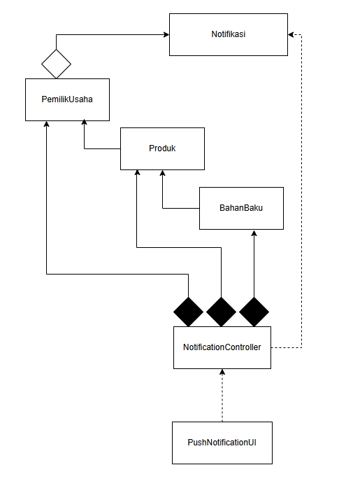

<i>Gambar 10. Diagram Kelas Use Case UC10</i>

 

| ID Kelas | Nama Kelas | Atribut | Metode/Operasi |
| :--- | :--- | :--- | :--- |
| *C01* | *PemilikUsaha* | *username, password* | *getUsername()* |
| *C02* | *Produk* | *nama, hargaJual, margin, statusPeringatan* | *getMargin(), setStatusPeringatan(), getStatusPeringatan()* |
| *C03* | *BahanBaku* | *namaBahan, hargaBeli* | *setHargaBeli(), getHargaBeli()* |
| *C17* | *Notifikasi* | *idNotifikasi, pesanAlert, waktuKirim, isRead* | *getPesanAlert(), markAsRead()* |
| *C18* | *PushNotificationUI* | *notifikasiAktif* | *tampilkanNotifikasi(), onClickNotification()* |
| *C19* | *NotificationController* | *currentPemilik, targetProduk* | *cekMarginNegatif(), buatNotifikasiKerugian(), kirimNotifikasi()* |

### 4.2.10 Use Case UC10

**Nama Use Case:** *Menerima Notifikasi Perubahan Harga Bahan Baku*

#### Identifikasi Kelas

| ID Kelas | Nama Kelas | Deskripsi Kelas |
| :--- | :--- | :--- |
| *C01* | *PemilikUsaha* | *Menyimpan data entitas akun pemilik usaha yang menjadi target penerima notifikasi (Entity Class).* |
| *C02* | *Produk* | *Menyimpan data entitas produk yang terdampak kerugian, termasuk status peringatan aktifnya (Entity Class).* |
| *C03* | *BahanBaku* | *Menyimpan data bahan baku yang mengalami pembaruan harga beli sehingga memicu kalkulasi ulang (Entity Class).* |
| *C17* | *Notifikasi* | *Menyimpan detail pesan peringatan kerugian, waktu dikirim, dan status keterbacaan (Entity Class).* |
| *C18* | *PushNotificationUI* | *Antarmuka notifikasi sistem operasi (OS) yang muncul di perangkat pengguna (Boundary Class).* |
| *C19* | *NotificationController* | *Mendeteksi hasil margin negatif setelah pembaruan harga, membuat objek notifikasi, dan memicu pengiriman pesan (Controller Class).* |

#### Diagram Kelas

<i>Gambar 11. Diagram Kelas Use Case UC11</i>

 

| ID Kelas | Nama Kelas | Atribut | Metode/Operasi |
| :--- | :--- | :--- | :--- |
| *C01* | *PemilikUsaha* | *username, password* | *getUsername()* |
| *C02* | *Produk* | *nama, hargaJual, margin, statusPeringatan* | *getMargin(), setStatusPeringatan(), getStatusPeringatan()* |
| *C03* | *BahanBaku* | *namaBahan, hargaBeli* | *setHargaBeli(), getHargaBeli()* |
| *C17* | *Notifikasi* | *idNotifikasi, pesanAlert, waktuKirim, isRead* | *getPesanAlert(), markAsRead()* |
| *C18* | *PushNotificationUI* | *notifikasiAktif* | *tampilkanNotifikasi(), onClickNotification()* |
| *C19* | *NotificationController* | *currentPemilik, targetProduk* | *cekMarginNegatif(), buatNotifikasiKerugian(), kirimNotifikasi()* |

### 4.2.11 Use Case UC11

**Nama Use Case:** *Mengubah Data Akun*

#### Identifikasi Kelas

| ID Kelas | Nama Kelas | Deskripsi Kelas |
| :--- | :--- | :--- |
| *C01* | *PemilikUsaha* | *Menyimpan data entitas akun pemilik usaha yang ingin mengubah data akun (Entity Class).* |
| *C25* | *ProfilePage* | *Antarmuka untuk mengedit data akun user serta proses logout akun (Boundary Class).* |
| *C26* | *ProfileController* | *Melakukan perubahan dan validasi pada data akun user, serta proses logout akun (Controller Class).* |

#### Diagram Kelas

<i>Gambar 12. Diagram Kelas Use Case UC11</i>

 

| ID Kelas | Nama Kelas | Atribut | Metode/Operasi |
| :--- | :--- | :--- | :--- |
| *C01* | *PemilikUsaha* | *username, password* | *getUsername()* |
| *C25* | *ProfilePage* | *namaUsahaInput, emailInput, noTelpInput, passwordInput* | *showPage(), getProfileInput(), clickLogout(), showSuccessMessage(), showErrorMessage()* |
| *C26* | *ProfileController* | *currentPemilik* | *validateProfileData(), updateProfileData(), processLogout(), endSession()* |

### 4.2.12 Use Case UC12

**Nama Use Case:** *Keluar dari Akun*

#### Identifikasi Kelas

| ID Kelas | Nama Kelas | Deskripsi Kelas |
| :--- | :--- | :--- |
| *C01* | *PemilikUsaha* | *Menyimpan data entitas akun pemilik usaha yang ingin mengganti akun (Entity Class).* |
| *C25* | *ProfilePage* | *Antarmuka untuk mengedit data akun user serta proses logout akun (Boundary Class).* |
| *C26* | *ProfileController* | *Melakukan perubahan dan validasi pada data akun user, serta proses logout akun (Controller Class).* |

#### Diagram Kelas

<i>Gambar 13. Diagram Kelas Use Case UC12</i>

 

| ID Kelas | Nama Kelas | Atribut | Metode/Operasi |
| :--- | :--- | :--- | :--- |
| *C01* | *PemilikUsaha* | *username, password* | *getUsername()* |
| *C25* | *ProfilePage* | *namaUsahaInput, emailInput, noTelpInput, passwordInput* | *showPage(), getProfileInput(), clickLogout(), showSuccessMessage(), showErrorMessage()* |
| *C26* | *ProfileController* | *currentPemilik* | *validateProfileData(), updateProfileData(), processLogout(), endSession()* |

## 4.3 Diagram Kelas Keseluruhan

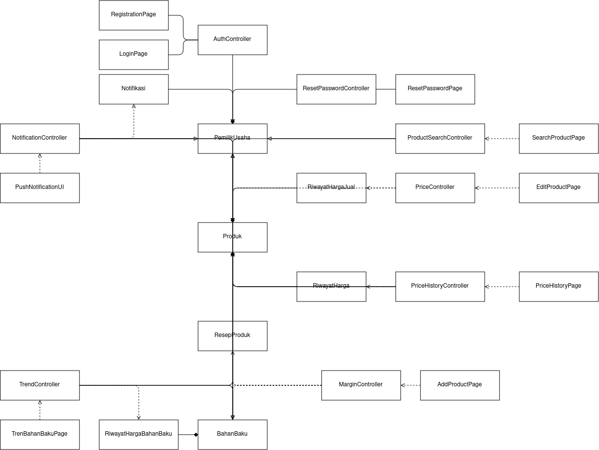

<i>Gambar 14. Diagram Kelas Keseluruhan</i>

 

| ID Kelas | Nama Kelas | Atribut | Metode/Operasi |
| :--- | :--- | :--- | :--- |
| *C01* | *PemilikUsaha* | *namaUsaha, email, noTelp, password* | *createUser(), getNamaUsaha(), setNamaUsaha(), getEmail() setEmail(), getNoTelp(), setNoTelp(), getPassword(), setPassword()* |
| *C02* | *Produk* | *namaProduk, tag, hargaJual, margin* | *getNamaProduk(), setNamaProduk(), getTag(), setTag(), getHargaJual(), setHargaJual(), setMargin(), getMargin()* |
| *C03* | *BahanBaku* | *namaBahan, hargaBeli* | *getNamaBahan(), getHargaBeli()* |
| *C04* | *ResepBahan* | *takaran* | *getTakaran(), setTakaran()* |
| *C05* | *RegistrationPage* | *usernameInput, emailInput, passwordInput* | *submitForm(), displaySuccess(), displayError()* |
| *C06* | *AuthController* | *-* | *validateData()* |
| *C07* | *LoginPage* | *usernameInput, passwordInput* | *login(), navigateToResetPassword(), displayError()* |
| *C08* | *ResetPasswordPage* | *emailInput, newPasswordInput, confirmNewPassword* | *submitResetRequest(), submitNewPassword(), displayError(), displaySuccess()* |
| *C09* | *ResetPasswordController* | *-* | *validateData(), resetPassword()* |
| *C10* | *AddProductPage* | *inputNamaProduk, inputTag, inputTakaran, inputHargaJual* | *showPage(), getInput(), showErrorMessage(), showSuccessMessage()* |
| *C11* | *MarginController* | *currentProduk, currentResep* | *validasiNamaProduk(), validasiInput(), simpanProdukBaru(), simpanResep()* |
| *C12* | *EditProductPage* | *hargaBaruInput* | *showPage(), getInput(), showSuccessMessage(), showErrorMessage()* |
| *C13* | *PriceController* | *currentPemilik, currentProduk* | *validasiInput(), updateHargaProduk(), catatRiwayat()* |
| *C14* | *RiwayatHargaBahanBaku* | *hargaBeliLama, waktuPerubahan* | *getHargaBeliLama(), getWaktuPerubahan()* |
| *C15* | *TrendBahanBakuPage* | *bahanBakuTerpilih, rentangWaktuFilter* | *showPage(), showChart(), showErrorMessage()* |
| *C16* | *TrendBahanBakuController* | *McurrentPemilik, currentBahanBaku* | *getRiwayatHarga(), filterDataByDate(), generateChartData()* |
| *C17* | *Notifikasi* | *idNotifikasi, pesanAlert, waktuKirim, isRead* | *getPesanAlert(), markAsRead()* |
| *C18* | *PushNotificationUI* | *notifikasiAktif* | *tampilkanNotifikasi(), onClickNotification()* |
| *C19* | *NotificationController* | *currentPemilik, targetProduk* | *cekMarginNegatif(), buatNotifikasiKerugian(), kirimNotifikasi()* |
| *C20* | *RiwayatHargaJual* | *hargaJualama, hargaBaru, waktuPerubahan* |setHargaJualLama(), setWaktuPerubahan(), getHargaLama(), getHargaBaru(), getWaktuPerubahan()|
| *C21* | *SearchProductPage* | *kataKunciPencarian, hasilPencarian* | showPage(), showResults(), showErrorMessage()|
| *C22* | *ProductSearchController* | *currentPemilik, kataKunci* | searchProduk(), filterByTag()|
| *C23* | *RiwayatHargaJualPage* | *produkTerpilih, rentangWaktuFilter* | showPage(), showChart(), showErrorMessage()|
| *C24* | *RiwayatHargaJualController* | *currentPemilik, currentProduk* | getRiwayatHarga(), filterDataByDate(), generateChartData()|
| *C25* | *ProfilePage* | *namaUsahaInput, emailInput, noTelpInput, passwordInput* | *showPage(), getProfileInput(), clickLogout(), showSuccessMessage(), showErrorMessage()* |
| *C26* | *ProfileController* | *currentPemilik* | *validateProfileData(), updateProfileData(), processLogout(), endSession()* |

---

# BAB 5: Traceability

| ID Kelas | ID Use Case | ID KF |
| :--- | :--- | :--- |
| *C01* | *UC01, UC02, UC03, UC04, UC05, UC06, UC07, UC08, UC09, UC10, UC11, UC12* | *KF01, KF02, KF03, KF04, KF05, KF06, KF07, KF08, KF09, KF10, KF11, KF12, KF13, KF14, KF15, KF16, KF17, KF18, KF19, KF20, KF21, KF22, KF23, KF24* |
| *C02* | *UC03, UC04, UC05, UC06, UC07, UC09* | *KF05, KF06, KF07, KF08, KF09, KF10, KF11, KF12, KF13, KF14, KF15, KF16, KF17, KF18, KF21* |
| *C03* | *UC03, UC04, UC08, UC09* | *KF05, KF06, KF07, KF08, KF09, KF10, KF11, KF12, KF13, KF14, KF19, KF20, KF21* |
| *C04* | *UC03, UC04* | *KF05, KF06, KF07, KF10, KF11, KF12* |
| *C05* | *UC01* | *KF01, KF02* |
| *C06* | *UC01, UC02* | *KF01, KF02, KF03, KF04* |
| *C07* | *UC02* | *KF03, KF04* |
| *C08* | *UC02* | *KF03, KF04* |
| *C09* | *UC02* | *KF03, KF04* |
| *C10* | *UC03, UC04* | *KF05, KF06, KF07, KF08, KF09, KF10, KF11, KF12, KF13, KF14* |
| *C11* | *UC03, UC04* | *KF05, KF06, KF07, KF08, KF09, KF10, KF11, KF12, KF13, KF14* |
| *C12* | *UC05* | *KF08, KF09* |
| *C13* | *UC05, UC07* | *KF08, KF09, KF17, KF18* |
| *C14* | *UC08* | *KF19, KF20* |
| *C15* | *UC08* | *KF19, KF20* |
| *C16* | *UC08* | *KF19, KF20* |
| *C17* | *UC09, UC10* | *KF20, KF22* |
| *C18* | *UC09, UC10* | *KF20, KF22* |
| *C19* | *UC09, UC10* | *KF20, KF22* |
| *C20* | *UC05, UC07* | *KF08, KF09, KF17, KF18* |
| *C21* | *UC06* | *KF15, KF16* |
| *C22* | *UC06* | *KF15, KF16* |
| *C23* | *UC07* | *KF17, KF18* |
| *C24* | *UC07* | *KF17, KF18* |
| *C25* | *UC11, UC12* | *KF23, KF24* |
| *C26* | *UC11, UC12* | *KF23, KF24* |

---

# Referensi

- Diagram UML: [https://www.drawio.com/](https://www.drawio.com/), [https://staruml.io/](https://staruml.io/)
