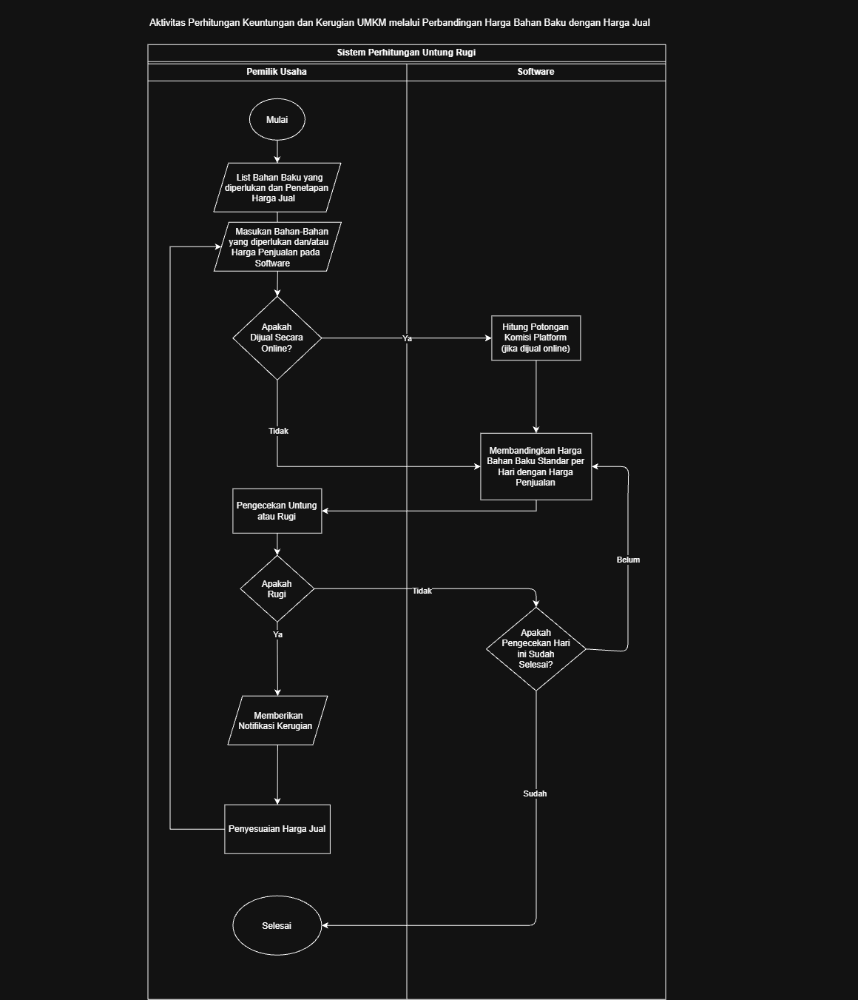
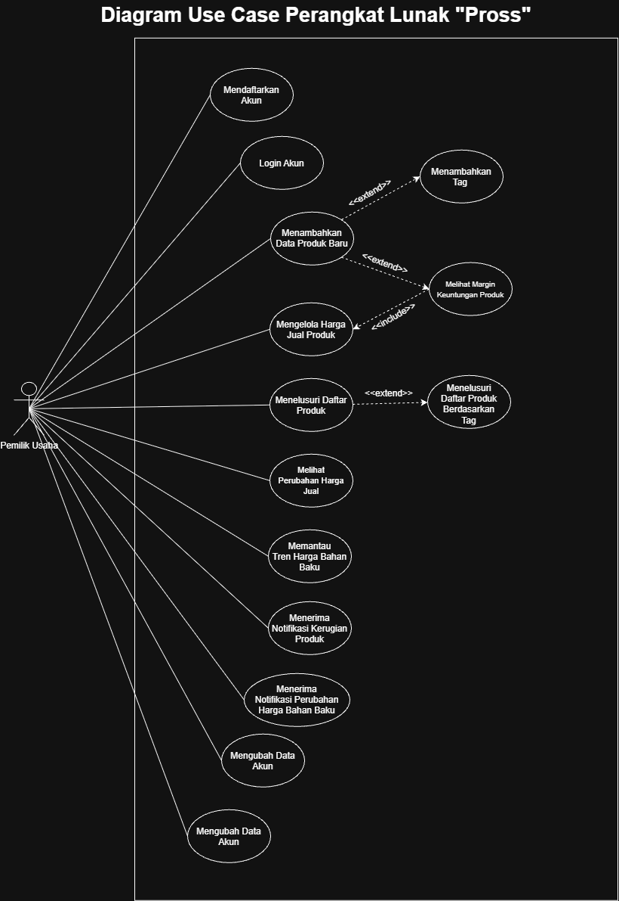

<h1>
IF2150 REKAYASA PERANGKAT LUNAK
 
TUGAS 5
 
SPESIFIKASI KEBUTUHAN PERANGKAT LUNAK (SKPL)
</h1>
 

## *Pross*

### Untuk: *Stefani Angeline Oroh*

Dipersiapkan oleh:
| Informasi | Keterangan |
| --- | --- |
| Kelas | *K02* |
| Kelompok | *G07* |

| NIM | Nama |
| --- | --- |
| *13525002* | *Ahmad Boutros Fathir* |
| *13525020* | *Klio Lysander* |
| *13525047* | *Muhammad Fakhriyan Rizki M.* |
| *13525053* | *Kevin Sie* |
| *13525056* | *Mochammad Nuha Al Ghifari* |
| *13525062* | *Rafel Dzinun Muhammad* |
---

## Daftar Perubahan

| Revisi | Deskripsi |
| :--- | :--- |
| *A* | *Deskripsikan perubahan yang dilakukan dari dokumen sebelumnya pada dokumen ini. Jika tidak terdapat perubahan, harap kosongkan tabel.* |
| *B* |  |
| *C* |  |
| ... |  |

 

# BAB 1: Pendahuluan

## 1.1 Tujuan Penulisan Dokumen
Tuliskan dengan ringkas tujuan dokumen SKPL ini dibuat dan siapa saja yang akan menggunakan dokumen ini.
Dokumen Spesifikasi Kebutuhan Perangkat Lunak ini disusun untuk mendokumentasikan setiap kebutuhan fungsional dan non-fungsional dari perangkat lunak *Pross* secara terstruktur dan sebagai acuan/referensi bagi anggota kelompok dalam proses perancangan dan implementasi sistem. Selain itu, dokumen ini juga berfungsi sebagai verifikasi bagi asisten atau dosen dalam menilai kesesuaian perangkat lunak ini.

## 1.2 Lingkup Masalah
Tuliskan dengan ringkas nama aplikasi dan deskripsi singkatnya. Bagian ini maksimal berisi satu paragraf, dapat diringkas dari BAB 1 *Analisis Permasalahan* pada dokumen *Topic Brainstorming*.
Pross merupakan aplikasi berbasis mobile yang berguna untuk manajemen harga pokok penjualan yang ditujukan bagi para pedagang kuliner UMKM. Aplikasi ini membantu pemilik usaha dalam memantau profitabilitas setiap produk secara otomatis berdasarkan perubahan harga bahan baku sehingga dapat mengetahui produk yang menguntungkan ataupun merugi tanpa perlu pencatatan secara manual.

## 1.3 Definisi, Istilah, dan Singkatan
Semua definisi dan singkatan yang digunakan dalam dokumen ini beserta penjelasannya.

Tabel 1.3. Definisi Istilah dan Singkatan

| Singkatan, Akronim, atau Istilah | Penjelasan |
| :--- | :--- |
| *P/L* | *Singkatan dari Perangkat Lunak, yaitu aplikasi yang memberikan perintah kepada komputer untuk menjalankan tugas tertentu.* |
| *SKPL* | *Singkatan dari Spesifikasi Kebutuhan Perangkat Lunak, yaitu dokumen yang merangkum kriteria-kriteria yang diperlukan untuk membangun aplikasi menjalankan tugasnya.* |
| *KF* | *Singkatan dari Kebutuhan Fungsional.* |
| *KNF* | *Singkatan dari Kebutuhan Non-Fungsional.* |
| *UC* | *Singkatan dari Use Case.* |
| *EARS* | *Easy Approach to Requirements Syntax, yaitu pola penulisan kebutuhan agar konsisten dan mudah diuji.* |
| *A* | *Singkatan dari Aktor.* |
| *C* | *Singkatan dari Class* |
| *Tag* | *Label yang diberikan pengguna pada suatu produk untuk mempermudah dalam pencarian.* |
| *...* | *...* |

## 1.4 Aturan Penomoran
Tuliskan aturan penomoran (ID) yang digunakan dalam dokumen ini. Gunakan pola ID yang **sama** dengan yang sudah dipakai pada dokumen-dokumen sebelumnya, jangan membuat pola baru di dokumen ini.

Tabel 1.4. Aturan Penomoran

| Hal/Bagian | Penomoran | Keterangan |
| :--- | :--- | :--- |
| *Kebutuhan Fungsional* | *KFXX* | |
| *Kebutuhan Non-Fungsional* | *KNFXX* | |
| *Aktor* | *AXX* | |
| *Use Case* | *UCXX* | |
| *Kelas* | *CXX* | |
| *...* | *...* |

## 1.5 Referensi
Dokumentasi P/L yang dirujuk oleh dokumen ini. Referensi dapat berupa buku, panduan, ataupun dokumentasi lain yang dipakai dalam pengembangan P/L ini.
1. Diagram UML: [https://www.drawio.com/](https://www.drawio.com/), [https://staruml.io/](https://staruml.io/)
2. CNBC Indonesia, "Harga Bawang Merah Bikin Menangis, Inflasi Kembali Ganas": [https://www.cnbcindonesia.com/research/20241201162945-128-592495/harga-bawang-merah-bikin-menangis-inflasi-kembali-ganas](https://www.cnbcindonesia.com/research/20241201162945-128-592495/harga-bawang-merah-bikin-menangis-inflasi-kembali-ganas)

## 1.6 Deskripsi Umum Dokumen (Ikhtisar)
Tuliskan sistematika pembahasan dokumen SKPL ini secara runut (misalnya: BAB 2 membahas deskripsi umum P/L, BAB 3 membahas kebutuhan fungsional dan non-fungsional, dst).
Dokumen ini terdiri dari enam bab. Bab 1 membahas mengenai pendahuluan yang meliputi tujuan penulisan, lingkup masalah, definisi istilah, aturan penomoran, referensi, dan ikhtisar dokumen. Bab 2 membahas mengenai deskripsi umum perangkat lunak Pross yang meliputi gambaran proses bisnis, pengguna, batas, dan lingkungan operasi. Bab 3 membahas kebutuhan fungsional dan non-fungsional secara rinci. Bab 4 membahas pemodelan use case yang mencakup identifikasi aktor, use case dan diagramnya, serta skenario tiap use case. Bab 5 membahas tentang pemodelan kelas yang mencakup identifikasi kelas, diagram kelas per use case, dan diagram kelas keseluruhan. Bab 6 membahas tentang traceability yang menghubungkan kelas, use case, dan kebutuhan fungsional secara menyeluruh.
---

# BAB 2: Deskripsi Perangkat Lunak

## 2.1 Deskripsi Umum Sistem
Bagian ini dapat disalin dari BAB 1.1 *Deskripsi Umum Sistem* pada dokumen *Requirement Gathering*, disesuaikan bila ada perubahan alur bisnis. Lengkapi dengan gambaran proses bisnis dalam bentuk *Activity Diagram* (boleh disalin dan diperbarui dari 3.3 *Model Proses Bisnis* pada dokumen *Topic Brainstorming*).

Perangkat lunak Pross merupakan aplikasi mobile manajemen Harga Pokok Penjualan (HPP) yang diperuntukkan khusus untuk pelaku kuliner UMKM yang ada di Bandung. Ekspektasi utama pengguna adalah terdapat sistem pemantauan profitabilitas menu yang praktis tanpa memerlukan sistem pembukuan pembukuan dan perhitungan yang rumit, sehingga mengamankan margin keuntungan ketika perubahan harga bahan baku. Alur kerja sistem dimulai dengan pengguna memasukkan daftar bahan baku, takaran pasti per produk, dan harga jual produk. Secara berkala, pengguna memperbarui data harga beli bahan baku. Sistem kemudian menghitung ulang biaya produksi secara otomatis. Apabila margin keuntungan menipis atau masuk ke fase rugi akibat lonjakan harga pasar, sistem akan langsung memicu push notification sebagai peringatan. Penerapan solusi ini diharapkan dapat menjadi langkah pengamanan pelaku UMKM dalam mengatasi kerugian. Melalui peringatan otomatis dan ketersediaan data tren harga, pemilik usaha dapat merespons perubahan harga pasar seperti menyesuaikan takaran atau mengubah harga jual sehingga terhindar dari kerugian operasional yang berlarut-larut.

<i>Gambar 1. Diagram Activity Penggunaan Perangkat Lunak</i>

## 2.2 Deskripsi Umum Perangkat Lunak
Diisi dengan deskripsi umum perangkat lunak untuk mendukung proses bisnis yang telah diuraikan pada sub-bab sebelumnya. Uraian harus menunjukkan lingkup perangkat lunak, mencakup keterkaitan perangkat lunak dengan sistem lain di luar (misalnya *Payment Gateway* atau layanan pihak ketiga lain yang dipakai).

*Contoh narasi:* "*[Nama P/L]* merupakan aplikasi *[deskripsi singkat]* yang berinteraksi dengan *Payment Gateway (dummy)* untuk memproses otorisasi pembayaran. Sistem menerima input dari *Pelanggan* melalui antarmuka aplikasi dan mengirimkan permintaan transaksi ke *Payment Gateway* setiap kali pelanggan melakukan checkout."

## 2.3 Pengguna dan Kebutuhan Pengguna Perangkat Lunak
Tuliskan seluruh jenis pengguna (*role*/aktor) yang terlibat dalam perangkat lunak (P/L), beserta kebutuhannya secara umum. Bagian ini dapat disalin dari 1.2 *Deskripsi Pengguna Perangkat Lunak* (dokumen Requirement Gathering) atau 3.1 *Identifikasi Aktor* (dokumen Use Case), pastikan sudah konsisten dengan aktor final yang dipakai di BAB 4.

| Pengguna | Kebutuhan |
| :--- | :--- |
| *Pemilik Usaha* | *Pengguna ini bertindak sebagai pihak utama yang menginput informasi terkait takaran bahan dan penetapan harga jual. Pengguna ini juga bertindak sebagai pengobservasi perubahan data historis serta penamaan dari produk-produk yang diinput. Karakteristik dari pengguna ini adalah mengutamakan data yang update dan valid, serta sistem yang sederhana.* |

## 2.4 Batasan Perangkat Lunak
Batasan yang harus dituliskan, di antaranya:
1. *P/L harus berfungsi pada platform mobile dan tidak dirancang untuk platform web atau desktop.*
2. *P/L tidak menggunakan file API dari pihak ketiga manapun termasuk*
3. *P/L mengumpulkan data dan profil usahan UMKM sehingga pengembangannya harus sesuai dengan Undang-Undang tentang perlindungan Data.*
4. *P/L tidak mencata biaya fixed cost seperti sewa tempat, listrik, atau gaji pegawai sehingga perhitungan untung//rugi difokuskan pada biaya bahan baku*
5. *P/L hanya berfungsi sebagai alat pemantauan dan peringatan kerugian, bukan sebagai alat pemrosesan transaksi*

## 2.5 Lingkungan Operasi Perangkat Lunak
Spesifikasi *operating system* atau lingkungan yang dibutuhkan P/L untuk beroperasi. Bagian ini digunakan untuk memastikan pengguna memiliki spesifikasi yang cukup untuk menjalankan P/L. Misalnya mencakup komponen server, client, OS, DBMS, tetapi tidak menutupi kemungkinan komponen lain.

| Komponen | Spesifikasi |
| :--- | :--- |
| *Server* | *Localhost untuk keperluan pengujian dan pengembangan* |
| *Client* | *Aplikasi mobile* |
| *DBMS* | *[contoh: PostgreSQL 15]* |
| *OS* | *Android* |
| *...* | *...* |

---

# BAB 3: Deskripsi Kebutuhan Perangkat Lunak

## 3.1 Kebutuhan Fungsional (KF)
Salin ulang **seluruh Kebutuhan Fungsional (KF)** versi terbaru dari BAB 2.1 dokumen *Class Diagram* (sudah versi final dan sudah memakai format EARS). Pastikan ID Kebutuhan (kolom "ID Kebutuhan") juga konsisten dengan ID pada tabel Pemetaan Kebutuhan di dokumen *Requirement Gathering*.

Tabel 3.1. Kebutuhan Fungsional

| ID KF | ID Kebutuhan | Penjelasan |
| :--- | :--- | :--- |
| *KF01* | *R01* | *Sistem harus menyediakan halaman registrasi akun bagi pengguna baru* |
| *KF02* | *R02* | *Ketika pengguna berhasil melakukan registrasi, sistem harus dapat menyimpan data pengguna baru ke dalam database* |
| *KF03* | *R04* | *Ketika pengguna akan masuk ke dalam akun, sistem harus menyediakan halaman login berupa username dan password dengan password dapat diatur visibilitynya* |
| *KF04* | *R05* | *Ketika pengguna login, sistem harus mencocokkan username dan password sesuai dengan data yang tersimpan di database* |
| *KF05* | *R06* | *Ketika pengguna menambahkan produk, sistem harus dapat memungkinkan pengguna menginput daftar bahan baku beserta dengan takaran yang digunakan untuk produk tertentu* |
| *KF06* | *R07* | *Sistem harus menyediakan langkah konfirmasi sebelum data bahan baku disimpan* |
| *KF07* | *R07* | *Ketika pengguna mengonfirmasi takaran bahan baku, sistem harus menyimpan data ke dalam database* |
| *KF08* | *R08* | *Ketika data bahan baku dan takarannya telah tersimpan, sistem harus menghitung total modal awal produk secara otomatis * |
| *KF09* | *R09 dan R14* | *Ketika pengguna menambahkan atau menyesuaikan produk, sistem harus dapat memungkinkan pengguna menginput harga jual suatu produk* |
| *KF10* | *R10 dan R15* | *Ketika pengguna menambahkan atau menyesuaikan harga jual, sistem harus menyimpan data tersebut ke dalam database sesuai dengan produknya* |
| *KF11* | *R11* | *Ketika harga modal dan harga jual tersedia, sistem harus membandingkan harga keduanya secara otomatis* |
| *KF12* | *R12* | *Ketika terdapat perbandingan harga modal dan harga jual, sistem harus menghitung keuntungan atau kerugian dan menampilkannya kepada pengguna* |
| *KF13* | *R16* | *Sistem memungkinkan pengguna untuk memberi nama dan tag pada suatu produk* |
| *KF14* | *R17* | *Ketika pengguna memberikan nama atau tag, sistem harus menyimpan nama atau tag tersebut ke dalam database* |
| *KF15* | *R18 dan R19* | *Sistem harus menampilkan daftar seluruh produk yang tersimpan di database kepada pengguna* |
| *KF16* | *R20* | *Ketika harga jual suatu produk berubah, sistem harus menyimpan perubahan tersebut sebagai data historis* |
| *KF17* | *R21 dan R22* | *Sistem harus menampilkan grafik tren perubahan harga jual suatu produk berdasarkan data historis* |
| *KF18* | *R23* | *Ketika harga bahan baku berubah, sistem harus menyimpan perubahan tersebut sebagai data historis* |
| *KF19* | *R24 dan R25* | *Sistem harus menampilkan grafik tren perubahan harga jual suatu produk berdasarkan data historis* |
| *KF20* | *R26 dan R27* | *Ketika suatu produk mengalami margin negatif, sistem harus mengirimkan notifikasi kepada pengguna* |
| *KF21* | *R28 dan R29* | *Ketika pengguna mencari produk berdasarkan nama, tag, atau bahan baku, sistem harus dapat menampilkan daftar produk terkait* |
| *KF22* | *R30 dan R31* | *Ketika terjadi perubahan harga pada suatu bahan baku, sistem harus mengirimkan notifikasi kepada pengguna terkait produk yang relevan* | 
| *KF23* | *R32 dan R33* | *Sistem harus memungkinkan pengguna melihat dan mengubah data profil akun (nama usaha, email, password, nomor telepon) serta menyimpan perubahannya ke dalam database* | 
| *KF24* | *R34 dan R35* | *Ketika pengguna memilih logout akun, sistem harus mengakhiri sesi aktif pengguna pada perangkat* |

## 3.2 Kebutuhan Non-Fungsional (KNF)
Salin ulang Kebutuhan Non-Fungsional dari BAB 2.5 dokumen *Requirement Gathering*, sesuaikan ID Kebutuhan (kolom "ID Kebutuhan") apabila terjadi perubahan penomoran pada BAB 3.1 di atas.

Tabel 3.2. Kebutuhan Non-Fungsional

| ID KNF | ID Kebutuhan | Parameter | Deskripsi Kebutuhan |
| :--- | :--- | :--- | :--- |
| *KF01* | *R01* | *Sistem harus menyediakan halaman registrasi akun bagi pengguna baru* |
| *KF02* | *R02* | *Ketika pengguna berhasil melakukan registrasi, sistem harus dapat menyimpan data pengguna baru ke dalam database* |
| *KF03* | *R04* | *Ketika pengguna akan masuk ke dalam akun, sistem harus menyediakan halaman login berupa username dan password dengan password dapat diatur visibilitynya* |
| *KF04* | *R05* | *Ketika pengguna login, sistem harus mencocokkan username dan password sesuai dengan data yang tersimpan di database* |
| *KF05* | *R06* | *Ketika pengguna menambahkan produk, sistem harus dapat memungkinkan pengguna menginput daftar bahan baku beserta dengan takaran yang digunakan untuk produk tertentu* |
| *KF06* | *R07* | *Sistem harus menyediakan langkah konfirmasi sebelum data bahan baku disimpan* |
| *KF07* | *R07* | *Ketika pengguna mengonfirmasi takaran bahan baku, sistem harus menyimpan data ke dalam database* |
| *KF08* | *R08* | *Ketika data bahan baku dan takarannya telah tersimpan, sistem harus menghitung total modal awal produk secara otomatis * |
| *KF09* | *R09 dan R14* | *Ketika pengguna menambahkan atau menyesuaikan produk, sistem harus dapat memungkinkan pengguna menginput harga jual suatu produk* |
| *KF10* | *R10 dan R15* | *Ketika pengguna menambahkan atau menyesuaikan harga jual, sistem harus menyimpan data tersebut ke dalam database sesuai dengan produknya* |
| *KF11* | *R11* | *Ketika harga modal dan harga jual tersedia, sistem harus membandingkan harga keduanya secara otomatis* |
| *KF12* | *R12* | *Ketika terdapat perbandingan harga modal dan harga jual, sistem harus menghitung keuntungan atau kerugian dan menampilkannya kepada pengguna* |
| *KF13* | *R16* | *Sistem memungkinkan pengguna untuk memberi nama dan tag pada suatu produk* |
| *KF14* | *R17* | *Ketika pengguna memberikan nama atau tag, sistem harus menyimpan nama atau tag tersebut ke dalam database* |
| *KF15* | *R18 dan R19* | *Sistem harus menampilkan daftar seluruh produk yang tersimpan di database kepada pengguna* |
| *KF16* | *R20* | *Ketika harga jual suatu produk berubah, sistem harus menyimpan perubahan tersebut sebagai data historis* |
| *KF17* | *R21 dan R22* | *Sistem harus menampilkan grafik tren perubahan harga jual suatu produk berdasarkan data historis* |
| *KF18* | *R23* | *Ketika harga bahan baku berubah, sistem harus menyimpan perubahan tersebut sebagai data historis* |
| *KF19* | *R24 dan R25* | *Sistem harus menampilkan grafik tren perubahan harga jual suatu produk berdasarkan data historis* |
| *KF20* | *R26 dan R27* | *Ketika suatu produk mengalami margin negatif, sistem harus mengirimkan notifikasi kepada pengguna* |
| *KF21* | *R28 dan R29* | *Ketika pengguna mencari produk berdasarkan nama, tag, atau bahan baku, sistem harus dapat menampilkan daftar produk terkait* |
| *KF22* | *R30 dan R31* | *Ketika terjadi perubahan harga pada suatu bahan baku, sistem harus mengirimkan notifikasi kepada pengguna terkait produk yang relevan* | 
| *KF23* | *R32 dan R33* | *Sistem harus memungkinkan pengguna melihat dan mengubah data profil akun (nama usaha, email, password, nomor telepon) serta menyimpan perubahannya ke dalam database* | 
| *KF24* | *R34 dan R35* | *Ketika pengguna memilih logout akun, sistem harus mengakhiri sesi aktif pengguna pada perangkat* | 

## 2.5 Kebutuhan Non-Fungsional (KNF)

Uraikan dengan ringkas Kebutuhan Non-Fungsional dalam tabel sebagai berikut. Isilah kolom kebutuhan dengan kalimat yang jelas, spesifik, dan terukur (kelak dapat diuji untuk dipenuhi). Kolom ID KNF adalah nomor Kebutuhan Non-Fungsional yang harus ditelusuri pada saat pengujian. Hubungkan ID Kebutuhan Non-Fungsional dengan ID Pemetaan Kebutuhan Umum dari sistem.

| ID KNF | ID Kebutuhan | Parameter | Deskripsi Kebutuhan |
| :--- | :--- | :--- | :--- |
| *KNF01* | *R01* | *Response time* | *Ketika pengguna mengirimkan formulir pendaftaran, sistem harus mendaftarkan akun baru ke dalam database dalam waktu kurang dari 3 detik.* |
| *KNF02* | *R01* | *Ergonomy* | *Sistem harus menyediakan formulir pembuatan akun yang hanya berisi field nama, email, dan password agar mudah diisi pengguna awam.* |
| *KNF03* | *R02* | *Reliability* | *Ketika pengguna menyelesaikan proses registrasi, sistem harus menyimpan data akun baru ke database tanpa terjadi kehilangan ataupun kerusakan data.* |
| *KNF04* | *R03* | *Security* | *Ketika pengguna mendaftar atau memperbarui password, sistem harus mengenkripsi password menggunakan algoritma hashing sebelum menyimpannya kedalam database sehingga password tidak pernah disimpan dalam bentuk plain text.* |
| *KNF05* | *R05* | *Response time* | *Ketika pengguna mengirimkan kredensial login, sistem harus memverifikasi identitas pengguna dalam waktu kurang dari 3 detik.* |
| *KNF06* | *R06* | *Availability* | *Sistem harus dapat diakses oleh pengguna 7 hari per minggu.* |
| *KNF07* | *R07* | *Reliability* | *Ketika pengguna menyimpan data bahan baku, sistem harus menyimpan data tersebut ke dalam database tanpa terjadi kehilangan atau duplikasi data.* |
| *KNF08* | *R06* | *Reliability* | *Ketika pengguna menginput data bahan baku, sistem harus memvalidasi nilai data tersebut sebelum disimpan ke database.* |
| *KNF09* | *R10 dan R15* | *Reliability* | *Ketika harga jual produk diperbarui, sistem harus menampilkan perubahan tersebut kepada pengguna saat halaman terkait dimuat ulang.* |
| *KNF10* | *R08* | *Response time* | *Ketika data bahan baku suatu produk telah tersedia, sistem harus menghitung HPP produk dalam waktu kurang dari 2 detik.* |
| *KNF11* | *R11* | *Response time* | *Ketika pengguna meminta perbandingan harga, sistem harus membandingkan harga jual dengan harga modal produk dalam waktu kurang dari 2 detik.* |
| *KNF12* | *R12 dan R13* | *Reliability* | *Sistem harus menghitung keuntungan/kerugian produk secara akurat sesuai rumus yang ditentukan, tanpa kesalahan logika perhitungan.* |
| *KNF13* | *R12* | *Response time* | *Ketika perhitungan margin keuntungan/kerugian selesai dilakukan, sistem harus menampilkan hasilnya kepada pengguna dalam waktu kurang dari 3 detik.* |
| *KNF14* | *R28 dan R29* | *Response time* | *Ketika pengguna melakukan pencarian produk berdasarkan nama atau tag, sistem harus menampilkan hasil pencarian dalam waktu kurang dari 2 detik.* |
| *KNF15* | *R28 dan R29* | *Ergonomy* | *Sistem harus menyediakan antarmuka pencarian dan penyaringan produk yang dapat diakses dalam tidak lebih dari 2 langkah.* |
| *KNF16* | *R21 dan R22* | *Response time* | *Jika fitur riwayat harga tersedia, ketika pengguna meminta menampilkan riwayat perubahan harga jual suatu produk, sistem harus menampilkan data tersebut dalam waktu kurang dari 3 detik.* |

*Silakan pilih parameter yang relevan dengan P/L kalian (Availability, Reliability, Ergonomy, Portability, Memory, Response time, Safety, Security, dsb), tidak perlu semua parameter diisi. Lihat kembali dokumen Requirement Gathering untuk penjelasan tiap parameter.*

---

# BAB 4: Pemodelan Use Case

## 4.1 Identifikasi Aktor
Salin ulang daftar aktor final dari BAB 3.1 dokumen *Use Case & Scenario Use Case* atau *Class Diagram*. Tambahkan ID Aktor mengikuti Aturan Penomoran pada 1.4.

| ID Aktor | Aktor | Deskripsi |
| :--- | :--- | :--- |
| *A01* | *Pemilik Usaha* | *Pengguna utama sistem yang mengelola data setiap produk, memantau keuntungan/kerugian, menerima notifikasi kerugian, dan melihat tren harga bahan baku untuk pengambilan keputusan bisnis.* |
| *...* | *...* | *...* |

## 4.2 Identifikasi Use Case
Salin ulang daftar Use Case versi terbaru dari BAB 3.2 dokumen *Class Diagram*, pastikan seluruh ID KF yang dirujuk sudah sesuai dengan tabel pada 3.1.

| ID UC | Nama Use Case | Deskripsi Singkat | Aktor | ID KF |
| :--- | :--- | :--- | :--- | :--- |
| *UC01* | *Mendaftarkan Akun* | *Pemilik usaha membuat akun baru untuk menyimpan data usahanya di sistem.* | *Pemilik Usaha* | *KF01, KF02* |
| *UC02* | *Login dengan akun yang sudah terdaftar* | *Pemilik usaha dapat melakukan login sesuai dengan username dan password yang telah dibuat.* | *Pemilik Usaha* | *KF03, KF04* |
| *UC03* | *Menambahkan Data Produk Baru* | *Pemilik usaha menambahkan produk baru dengan resep bahan baku, tag, dan harga jual awal.* | *Pemilik Usaha* | *KF05, KF06, KF07, KF08, KF09, KF13, KF14* |
| *UC04* | *Melihat Margin Keuntungan Produk* | *Pemilik usaha dapat melihat keuntungan/kerugian pada produk yang telah ditambahkan* | *Pemilik Usaha* | *KF10, KF11, KF12* |
| *UC05* | *Mengelola Harga Jual Produk* | *Pemilik usaha dapat memperbarui harga jual produk agar sesuai dengan margin* | *Pemilik Usaha* | *KF08, KF09* |
| *UC06* | *Menelusuri Daftar Produk* | *Pemilik usaha dapat mencari dan melihat produk berdasarkan nama dan tag yang diinput* | *Pemilik Usaha* | *KF14, KF15, K21* |
| *UC07* | *Melihat Perubahan Harga Jual* | *Pemilik usaha dapat melihat data historis perubahan harga jual suatu produk* | *Pemilik Usaha* | *KF17, KF18* |
| *UC08* | *Memantau Tren Harga Bahan Baku* | *Pemilik usaha dapat melihat grafik perubahan harga bahan baku secara historis maupun real-time* | *Pemilik Usaha* | *KF19, KF20* |
| *UC09* | *Menerima Notifikasi Kerugian Produk* | *Pemilik usaha dapat mendapatkan peringatan ketika produk tertentu mengalami kerugian akibat perubahan harga bahan baku* | *Pemilik Usaha* | *KF20* |
| *UC10* | *Menerima Notifikasi Perubahan Harga Bahan Baku* | *Pemilik usaha dapat menerima peringatan ketika suatu bahan baku tertentu mengalami kenaikan harga.* | *Pemilik Usaha* | *KF22* |
| *UC11* | *Mengubah Data Akun* | *Pemilik usaha dapat mengubah data terkait akun pemilik usaha (Nama Usaha, Email, Password, dan Nomor Telepon) pada laman Profile.* | *Pemilik Usaha* | *KF23* |
| *UC12* | *Keluar dari Akun* | *Pemilik usaha keluar dari akun yang terdapat pada aplikasi.* | *Pemilik Usaha* | *KF24* |

## 4.3 Use Case Diagram
Salin ulang Use Case Diagram dari BAB 3.3 dokumen *Use Case & Scenario Use Case* atau *Class Diagram* (gunakan versi paling akhir/terbaru apabila terdapat perubahan).

<i>Gambar 2. Use Case Diagram Perangkat Lunak Pross</i>

## 4.4 Skenario Use Case
Salin ulang skenario **setiap** use case (skenario normal dan alternatif) dari BAB 3.4 dokumen *Use Case & Scenario Use Case*, sesuaikan dengan daftar UC final pada 4.2. Jika use case melibatkan lebih dari satu aktor manusia yang benar-benar berinteraksi langsung (misalnya *Kasir* yang memverifikasi transaksi setelah *Pelanggan* membayar), tambahkan kolom aksi tersendiri untuk aktor tersebut di samping kolom "Reaksi Perangkat Lunak". Sistem eksternal otomatis seperti *payment gateway* **bukan aktor**, sehingga interaksinya cukup dituliskan sebagai bagian dari "Reaksi Perangkat Lunak", bukan kolom aktor terpisah.

### 4.4.1 Skenario UC01

**Nama Use Case:** *Mendaftarkan Akun*

**Skenario Normal**

| No | Aksi Aktor | Reaksi Perangkat Lunak |
| :--- | :--- | :--- |
| 1 | *Pemiliki usaha membuka perangkat lunak* | *Sistem menampilkan halaman registrasi/login* |
| 2 | *Pemilik usaha memilih opsi registrasi* | *Sistem mengarahkan ke halaman pembuatan akun* |
| 3 | *Pemilik usaha mengisi seluruh data registrasi yang dibutuhkan dan melakukan konfirmasi dengan menekan tombol "Buat Akun"* | *Sistem menerima respons pembuatan okun, menyimpan data pengguna ke database, dan menampilkan halaman utama perangkat lunak* |

 

**Skenario Alternatif 1: Data Registrasi Belum Lengkap**

| No | Aksi Aktor | Reaksi Perangkat Lunak |
| :--- | :--- | :--- |
| 1 | *Pemiliki usaha membuka perangkat lunak* | *Sistem menampilkan halaman registrasi/login* |
| 2 | *Pemilik usaha memilih opsi registrasi* | *Sistem mengarahkan ke halaman pembuatan akun* |
| 3 | *Pemilik usaha mengisi data registrasi secara tidak lengkap dan melakukan konfirmasi dengan menekan tombol "Buat Akun"* | *Sistem mendeteksi adanya data yang belum diisi dan menampilkan pesan error "Data Registrasi Belum Lengkap". Sistem akan meminta pengguna untuk mengisi data registrasi hingga lengkap* |

 

**Skenario Alternatif 2: Akun yang Dibuat Sudah Terdaftar**

| No | Aksi Aktor | Reaksi Perangkat Lunak |
| :--- | :--- | :--- |
| 1 | *Pemiliki usaha membuka perangkat lunak* | *Sistem menampilkan halaman registrasi/login* |
| 2 | *Pemilik usaha memilih opsi registrasi* | *Sistem mengarahkan ke halaman pembuatan akun* |
| 3 | *Pemilik usaha mengisi seluruh data registrasi yang dibutuhkan dan melakukan konfirmasi dengan menekan tombol "Buat Akun"* | *Sistem mendeteksi bahwa data yang diinput sudah terdapat di database, menandakan bahwa akun sudah pernah dibuat. Sistem akan memberikan pesan "Akun sudah dibuat" dan mengembalikan pengguna pada halaman registrasi agar pengguna dapat mengganti data* |

 

**Skenario Alternatif 3: Password tidak memenuhi ketentuan yang diberikan**

| No | Aksi Aktor | Reaksi Perangkat Lunak |
| :--- | :--- | :--- |
| 1 | *Pemiliki usaha membuka perangkat lunak* | *Sistem menampilkan halaman registrasi/login* |
| 2 | *Pemilik usaha memilih opsi registrasi* | *Sistem mengarahkan ke halaman pembuatan akun* |
| 3 | *Pemilik usaha mengisi seluruh data registrasi yang dibutuhkan dan melakukan konfirmasi dengan menekan tombol "Buat Akun"* | *Sistem mendeteksi bahwa password yang diinput tidak sesuai dengan ketentuan dan memberikan pesan "Password terlalu lemah" dan mengembalikan pengguna pada halaman registrasi agar pengguna dapat memperbaiki password* |

 

### 4.4.2 Skenario UC02

**Nama Use Case:** *Login Dengan Akun yang Sudah Terdaftar*

**Skenario Normal**

| No | Aksi Aktor | Reaksi Perangkat Lunak |
| :--- | :--- | :--- |
| 1 | *Pemiliki usaha membuka perangkat lunak* | *Sistem menampilkan halaman registrasi/login* |
| 2 | *Pemilik usaha memilih opsi login* | *Sistem mengarahkan ke halaman login* |
| 3 | *Pemilik usaha mengisi username dan password dari akun yang ingin di login dengan tepat dan melakukan konfirmasi dengan menekan tombol "Login"* | *Sistem menerima respons data akun, memverifikasi data, dan menampilkan halaman utama perangkat lunak* |

 

**Skenario Alternatif 1: Username atau Password Tidak Sesuai**

| No | Aksi Aktor | Reaksi Perangkat Lunak |
| :--- | :--- | :--- |
| 1 | *Pemiliki usaha membuka perangkat lunak* | *Sistem menampilkan halaman registrasi/login* |
| 2 | *Pemilik usaha memilih opsi login* | *Sistem mengarahkan ke halaman login* |
| 3 | *Pemilik usaha mengisi username dan password dari akun yang ingin di login, tetapi salah satu atau keduanya tidak tepat dan melakukan konfirmasi dengan menekan tombol "Login"* | *Sistem menerima respons data akun, memverifikasi data, mendeteksi ketidaksesuaian, dan menampilkan pesan error "Username atau Password Salah"* |

 

**Skenario Alternatif 2: Akun Belum Dibuat**

| No | Aksi Aktor | Reaksi Perangkat Lunak |
| :--- | :--- | :--- |
| 1 | *Pemiliki usaha membuka perangkat lunak* | *Sistem menampilkan halaman registrasi/login* |
| 2 | *Pemilik usaha memilih opsi login* | *Sistem mengarahkan ke halaman login* |
| 3 | *Pemilik usaha mengisi username dan password dari akun yang belum pernah dibuat dan melakukan konfirmasi dengan menekan tombol "Login"* | *Sistem menerima respons data akun, memverifikasi data, gagal menemukan data, dan menampilkan pesan error "Tidak dapat menemukan akun"* |    

 

**Skenario Alternatif 3: Reset Password**

| No | Aksi Aktor | Reaksi Perangkat Lunak |
| :--- | :--- | :--- |
| 1 | *Pemiliki usaha membuka perangkat lunak* | *Sistem menampilkan halaman registrasi/login* |
| 2 | *Pemilik usaha memilih opsi login* | *Sistem mengarahkan ke halaman login* |
| 3 | *Pemilik usaha mengisi username dan password dari akun yang belum pernah dibuat dan melakukan konfirmasi dengan menekan tombol "Login"* | *Sistem menerima respons data akun, memverifikasi data, gagal mencocokan data pengguna, dan menampilkan pesan error "Username atau Password Salah"* |    
| 4 | *Pemilik usaha menekan tombol "Lupa Password* | *Sistem mengalihkan Pengguna menuju laman reset password* |
| 5 | *Pemilik usaha mengisi password baru* | *Sistem menyikpan data password baru yang telah diisi oleh pengguna* |    

 

### 4.4.3 Skenario UC03

**Nama Use Case:** *Menambahkan Data Produk Baru*

**Skenario Normal**

| No | Aksi Aktor | Reaksi Perangkat Lunak |
| :--- | :--- | :--- |
| 1 | *Pemilik usaha menekan tombol "+" pada halaman dashboard* | *Sistem mengalihkan pengguna menuju halaman penambahan produk baru* |
| 2 | *Pemilik usaha menginput nama dari produk beserta tag (opsional) dan melakukan konfirmasi dengan menekan tombol "Ok"* | *Sistem menerima input nama produk, tag, memverifikasi nama, menyimpan nama dan tag ke database, dan menampilkan halaman menu "Tambah Produk Baru" yang melibatkan input bahan baku, takaran, dan harga jual* |
| 3 | *Pemilik usaha menginput bahan baku, takarannya, dan harga jualnya, lalu melakukan konfirmasi dengan menekan tombol "Kalkulasi"* | *Sistem menerima input data, dan menyimpannya di database* |

 

**Skenario Alternatif 1: Nama Produk Sudah Pernah Dibuat**

| No | Aksi Aktor | Reaksi Perangkat Lunak |
| :--- | :--- | :--- |
| 1 | *Pemilik usaha menekan tombol "+" pada halaman utama* | *Sistem mengalihkan pengguna menuju halaman penambahan produk baru* |
| 2 | *Pemilik usaha menginput nama dari produk yang sudah pernah dibuat beserta tag (opsional) dan melakukan konfirmasi dengan menekan tombol "Ok"* | *Sistem menerima input nama produk, memverifikasi nama, mendeteksi bahwa nama produk sudah terdapat di database, dan memberikan pesan error "Nama Produk Sudah Pernah Dibuat". Sistem akan mengembalikan pengguna pada halaman input nama produk dan tag* |

 

**Skenario Alternatif 2: Input Jumlah Takaran atau Harga Jual Invalid**

| No | Aksi Aktor | Reaksi Perangkat Lunak |
| :--- | :--- | :--- |
| 1 | *Pemilik usaha menekan tombol "+" pada halaman utama* | *Sistem mengalihkan pengguna menuju halaman penambahan produk baru* |
| 2 | *Pemilik usaha menginput nama dari produk beserta tag (opsional) dan melakukan konfirmasi dengan menekan tombol "Ok"* | *Sistem menerima input nama produk, memverifikasi nama, menyimpan namanya ke database, dan menampilkan halaman menu "Tambah Produk Baru" yang melibatkan input bahan baku, takaran, dan harga jual* |
| 3 | *Pemilik usaha menginput bahan baku, takarannya, dan harga jualnya, tetapi nilainya invalid, lalu melakukan konfirmasi dengan menekan tombol "Kalkulasi" * | *Sistem menerima input data, mendeteksi nilai yang invalid, lalu memberikan pesan error "Input Takaran / Harga Jual Tidak Valid" dan mengembalikan pengguna pada halaman "Tambah Produk Baru"* |

 

### 4.4.4 Skenario UC04

**Nama Use Case:** *Melihat Margin Keuntungan Produk*

**Skenario Normal**

| No | Aksi Aktor | Reaksi Perangkat Lunak |
| :--- | :--- | :--- |
| 1 | *Setelah konfirmasi, pemilik usaha akan melihat perbandingan nilai harga jual yang ditetapkan dengan harga standar berdasarkan bahan baku* | *Sistem melakukan perbandingan terhadap harga jual dan harga standar, menemukan bahwa margin bernilai positif, lalu menampilkan data harga dan margin* |
| 2 | *Pemilik usaha melakukan konfirmasi setelah melihat margin yang bernilai positif dengan menekan tombol "Selesai"* | *Sistem mengembalikan pengguna ke halaman utama* |

 

**Skenario Alternatif 1: Harga Jual yang Ditetapkan Rugi**

| No | Aksi Aktor | Reaksi Perangkat Lunak |
| :--- | :--- | :--- |
| 1 | *Setelah konfirmasi, pemilik usaha akan melihat perbandingan nilai harga jual yang ditetapkan dengan harga standar berdasarkan bahan baku* | *Sistem melakukan perbandingan terhadap harga jual dan harga standar, menemukan bahwa margin bernilai negatif, lalu menampilkan data hargam margin, dan pesan "Harga Jual yang Ditetapkan Memiliki Margin Negatif". Sistem akan meminta pengguna untuk mengganti harga jual* |
| 2 | *Pemilik usaha melakukan perbaikan terhadap nilai harga jual dan melakukan konfirmasi ulang.* | *Sistem melakukan perbandingan terhadap harga jual baru dan harga standar, menemukan bahwa margin bernilai positif, lalu menampilkan data harga dan margin* |
| 3 | *Pemilik usaha melakukan konfirmasi setelah melihat margin yang bernilai positif dengan menekan tombol "Selesai"* | *Sistem mengembalikan pengguna ke halaman utama* |

 

### 4.4.5 Skenario UC05

**Nama Use Case:** *Mengelola Harga Jual Produk*

**Skenario Normal**

| No | Aksi Aktor | Reaksi Perangkat Lunak |
| :--- | :--- | :--- |
| 1 | *Pemilik usaha memilih produk yang ingin diedit harga jualnya* | *Sistem mengalihkan pengguna menuju halaman edit untuk produk yang dipilih* |
| 2 | *Pemilik usaha mengisi dan menyimpan harga jual produk yang baru* | *Sistem memvalidasi dan menyimpan harga jual produk yang baru kedalam database lalu menampilkan pesan "Berhasil Diedit"* |

 

**Skenario Alternatif 1: Input Bukan Merupakan Bilangan Positif**
| No | Aksi Aktor | Reaksi Perangkat Lunak |
| :--- | :--- | :--- |
| 1 | *Pemilik usaha memilih produk yang ingin diedit harga jualnya* | *Sistem mengalihkan pengguna menuju halaman edit untuk produk yang dipilih* |
| 2 | *Pemilik usaha mengetikkan dan menyimpan harga jual produk yang baru namun bukan merupakan bilangan positif* | *Sistem memvalidasi namun tidak berhasil menyimpan harga jual produk yang baru kedalam database lalu menampilkan pesan "Masukkan bilangan positif"* |

### 4.4.6 Skenario UC06

**Nama Use Case:** *Menelusuri Daftar Produk*

**Skenario Normal**

| No | Aksi Aktor | Reaksi Perangkat Lunak |
| :--- | :--- | :--- |
| 1 | *Pemilik Usaha mengetik keyword nama atau tag yang ingin dicari pada menu searching* | *Sistem mencari semua produk dengan nama atau tag yang relevan dan memunculkan beberapa produk yang memiliki keyword nama atau/dan tag terkait* |
| 2 | *Pemilik Usaha menekan tombol search* | *Sistem menampilkan semua produk dengan nama atau tag yang diinput* |

 

**Skenario Alternatif 1: Produk tidak ditemukan**

| No | Aksi Aktor | Reaksi Perangkat Lunak |
| :--- | :--- | :--- |
| 1 | *Pemilik Usaha mengetik keyword nama atau tag yang ingin dicari pada menu searching* | *Sistem mencari semua produk dengan nama atau tag yang relevan dan memunculkan beberapa produk yang memiliki keyword nama atau/dan tag terkait* |
| 2 | *Pemilik Usaha menekan tombol search* | *Sistem tidak dapat menampilkan produk dengan nama atau tag yang diinput dan menampilkan pesan "Tidak ada produk yang relevan"* |

### 4.4.7 Skenario UC07

**Nama Use Case:** *Melihat Perubahan Harga Jual*

**Skenario Normal**

| No | Aksi Aktor | Reaksi Perangkat Lunak |
| :--- | :--- | :--- |
| 1 | *Pemilik Usaha memilih suatu produk spesifik dari daftar produk yang terdapat pada halaman utama.* | *Sistem menampilkan halaman detail dari produk yang dipilih.* |
| 2 | *Pemilik Usaha menekan tombol atau tab "Riwayat Harga".* | *Sistem mengambil data historis dari database dan menampilkan daftar urutan perubahan harga jual produk tersebut beserta tanggal perubahannya.* |

 

**Skenario Alternatif 1: Belum Ada Data Historis**

| No | Aksi Aktor | Reaksi Perangkat Lunak |
| :--- | :--- | :--- |
| 1 | *Pemilik Usaha memilih suatu produk spesifik dari daftar produk yang terdapat pada halaman utama.* | *Sistem menampilkan halaman detail dari produk yang dipilih.* |
| 2 | *Pemilik Usaha menekan tombol atau tab "Riwayat Harga".* | *Sistem mendeteksi bahwa produk belum pernah mengalami perubahan harga jual sejak pertama kali dibuat dan menampilkan pesan "Belum ada riwayat perubahan harga untuk produk ini".* |

 

### 4.4.8 Skenario UC08

**Nama Use Case:** *Memantau Tren Harga Bahan Baku*

**Skenario Normal**

| No | Aksi Aktor | Reaksi Perangkat Lunak |
| :--- | :--- | :--- |
| 1 | *Pemilik Usaha melihat data perubahan harga bahan baku pada halaman utama.* | *Sistem memuat dan menampilkan daftar seluruh bahan baku yang pernah diinput ke dalam sistem.* |
| 2 | *Pemilik Usaha memilih salah satu bahan baku.* | *Sistem mengumpulkan data historis harga dari bahan baku tersebut dan mengonversinya menjadi visualisasi grafik tren harga.* |
| 3 | *Pemilik Usaha mengubah rentang waktu pada grafik.* | *Sistem memuat ulang grafik dan memperbarui tampilan visual sesuai dengan rentang waktu yang dipilih.* |

 

**Skenario Alternatif 1: Data Tidak Memenuhi Syarat Grafik**

| No | Aksi Aktor | Reaksi Perangkat Lunak |
| :--- | :--- | :--- |
| 1 | *Pemilik Usaha melihat data perubahan harga bahan baku pada halaman utama.* | *Sistem memuat dan menampilkan daftar seluruh bahan baku yang pernah diinput ke dalam sistem.* |
| 2 | *Pemilik Usaha memilih bahan baku yang baru saja ditambahkan.* | *Sistem mendeteksi bahwa jumlah titik data belum cukup untuk membentuk grafik dan menampilkan pesan "Data belum cukup untuk memvisualisasikan grafik tren harga".* |

 

**Skenario Alternatif 2: Bahan Baku Belum Pernah Mengalami Pembaruan Harga**

| No | Aksi Aktor | Reaksi Perangkat Lunak |
| :--- | :--- | :--- |
| 1 | *Pemilik Usaha melihat data perubahan harga bahan baku pada halaman utama.* | *Sistem memuat dan menampilkan daftar seluruh bahan baku yang pernah diinput ke dalam sistem.* |
| 2 | *Pemilik Usaha memilih bahan baku yang harganya belum pernah diperbarui sejak pertama didaftarkan.* | *Sistem menampilkan harga saat ini berupa teks nominal tanpa memuat grafik garis, disertai keterangan "Belum ada riwayat fluktuasi harga untuk bahan baku ini".* |

### 4.4.9 Skenario UC09

**Nama Use Case:** *Menerima Notifikasi Kerugian Produk*

**Skenario Normal**

| No | Aksi Aktor | Reaksi Perangkat Lunak |
| :--- | :--- | :--- |
| 1 | *Pemilik Usaha memperbarui harga jual bahan baku yang mengalami kenaikan.* | *Sistem menyimpan harga baru, melakukan kalkulasi HPP ulang, dan mendeteksi bahwa ada produk yang margin keuntungannya bernilai negatif.* |
| 2 | *Pemilik Usaha menutup aplikasi atau berpindah halaman.* | *Sistem memicu dan mengirimkan push notification ke perangkat Pemilik Usaha yang berisi nama produk yang terdampak.* |
| 3 | *Pemilik Usaha menekan push notification tersebut pada layar smartphone.* | *Sistem membuka aplikasi dan langsung mengarahkan pengguna ke halaman detail produk yang merugi tersebut.* |

 

**Skenario Alternatif 1: Pemilik Usaha Mengabaikan Push Notification**

| No | Aksi Aktor | Reaksi Perangkat Lunak |
| :--- | :--- | :--- |
| 1 | *Pemilik Usaha memperbarui harga jual bahan baku yang mengalami kenaikan.* | *Sistem memproses kenaikan harga, mendeteksi kerugian, dan mengirimkan push notification.* |
| 2 | *Pemilik Usaha mengabaikan atau menghapus (swipe) notifikasi tersebut dari layar.* | *Sistem tetap menyematkan label peringatan visual (ikon alert merah) pada produk yang bersangkutan di database UI.* |
| 3 | *Pemilik Usaha membuka halaman Daftar Produk secara manual.* | *Sistem menampilkan daftar produk beserta ikon peringatan kerugian yang masih aktif pada produk yang terdampak.* |

### 4.4.10 Skenario UC10

**Nama Use Case:** *Menerima Notifikasi Perubahan Harga Bahan Baku*

**Skenario Normal**

| No | Aksi Aktor | Reaksi Perangkat Lunak |
| :--- | :--- | :--- |
| 1 | *Pemilik Usaha memperbarui harga jual bahan baku yang mengalami kenaikan.* | *Sistem menyimpan harga baru, melakukan kalkulasi HPP ulang, dan mendeteksi bahwa ada produk yang margin keuntungannya bernilai negatif.* |
| 2 | *Pemilik Usaha menutup aplikasi atau berpindah halaman.* | *Sistem memicu dan mengirimkan push notification ke perangkat Pemilik Usaha yang berisi nama produk yang terdampak.* |
| 3 | *Pemilik Usaha menekan push notification tersebut pada layar smartphone.* | *Sistem membuka aplikasi dan langsung mengarahkan pengguna ke halaman utama.* |

 

**Skenario Alternatif 1: Pemilik Usaha Mengabaikan Push Notification**

| No | Aksi Aktor | Reaksi Perangkat Lunak |
| :--- | :--- | :--- |
| 1 | *Pemilik Usaha memperbarui harga jual bahan baku yang mengalami kenaikan.* | *Sistem memproses kenaikan harga, mendeteksi kerugian, dan mengirimkan push notification.* |
| 2 | *Pemilik Usaha mengabaikan atau menghapus (swipe) notifikasi tersebut dari layar.* | *Sistem menyimpan notifikasi perubahan harga jual pada menu notifikasi dalam perangkat lunak* |
| 3 | *Pemilik Usaha menekan menu notifikasi pada halaman utama.* | *Sistem menampilkan list notifikasi pada menu notifikasi.* |

### 4.4.11 Skenario UC11

**Nama Use Case:** *Mengubah Mengubah Data Akun*

**Skenario Normal**

| No | Aksi Aktor | Reaksi Perangkat Lunak |
| :--- | :--- | :--- |
| 1 | *Pemilik Usaha menekan tombol "Profile" pada aplikasi.* | *Sistem mengalihkan pengguna menuju halaman "Profile".* |
| 2 | *Pemilik Usaha mengubah data pada akun Pemilik Usaha dan menekan tombol "Change".* | *Sistem memperbarui data milik Pemilik Usaha pada database.* |

 

### 4.4.12 Skenario UC12

**Nama Use Case:** *Keluar dari Akun*

**Skenario Normal**

| No | Aksi Aktor | Reaksi Perangkat Lunak |
| :--- | :--- | :--- |
| 1 | *Pemilik Usaha menekan tombol "Profile" pada aplikasi.* | *Sistem mengalihkan pengguna menuju halaman "Profile".* |
| 2 | *Pemilik Usaha menekan tombol "Logout" pada halaman "Profile".* | *Sistem menampilkan pop-up "Konfirmasi Logout".* |
| 2 | *Pemilik Usaha menekan tombol "Ya" pada pop-up "Konfirmasi Logout".* | *Sistem mengalihkan pengguna menuju halaman "Login" kembali setelah Pengguna menekan tombol "Logout".* |

 

**Skenario Alternatif 1: Pemilik Usaha Menekan Tombol "Tidak"**

| No | Aksi Aktor | Reaksi Perangkat Lunak |
| :--- | :--- | :--- |
| 1 | *Pemilik Usaha menekan tombol "Profile" pada aplikasi.* | *Sistem mengalihkan pengguna menuju halaman "Profile".* |
| 2 | *Pemilik Usaha menekan tombol "Logout" pada halaman "Profile".* | *Sistem menampilkan pop-up "Konfirmasi Logout".* |
| 2 | *Pemilik Usaha menekan tombol "Tidak" pada pop-up "Konfirmasi Logout".* | *Sistem mengembalikan tampilan aplikasi menjadi halaman "Profile" kembali.* |

---

# BAB 5: Pemodelan Kelas

## 5.1 Identifikasi Kelas
Salin ulang seluruh kelas yang telah diidentifikasi dari BAB 4.1 dokumen *Class Diagram*.

| ID Kelas | Nama Kelas | Deskripsi Kelas | ID Use Case |
| :--- | :--- | :--- | :--- |
| *C01* | *PemilikUsaha* | *Menyimpan seluruh data milik akun pemilik usaha berupa username, email, password, dan hal yang berkaitan dengan produk pemilik usaha (Entity Class).* | *UC01, UC02, UC03, UC04, UC05, UC06, UC07, UC08, UC09, UC10, UC11, UC12* |
| *C02* | *Produk* | *Menyimpan data produk berupa nama, harga jual, margin, dan tag yang dikelola oleh pemilik usaha (Entity Class).* | *UC03, UC04, UC05, UC06, UC07, UC09, UC10* |
| *C03* | *BahanBaku* | *Menyimpan data harga beli bahan baku yang digunakan sebagai resep produk (Entity Class).* | *UC03, UC04, UC08, UC09, UC10* |
| *C04* | *ResepBahan* | *Menyimpan takaran bahan baku yang digunakan dalam suatu produk (Entity Class).* | *UC03, UC04* |
| *C05* | *RegistrationPage* | *Antarmuka untuk menerima input data Username, Email dan Password pemilik usaha serta tombol "Buat Akun" untuk mendaftarkan akun pemilik usaha ke dalam database milik perangkat lunak (Boundary Class).* | *UC01* |
| *C06* | *AuthController* | *Memastikan bahwa input yang dilakukan oleh pemilik usaha pada halaman registrasi dan halaman login sudah sesuai dengan data yang dimiliki oleh perangkat lunak (Controller).* | *UC01, UC02* |
| *C07* | *LoginPage* | *Antarmuka untuk menerima input data Username/Email dan Password pemilik usaha serta tombol "Login" (Boundary Class).* | *UC02* |
| *C08* | *ResetPasswordPage* | *Antarmuka untuk menerima input berupa password baru yang dibuat oleh user dan merupakan password yang berbeda dengan password lama (Boundary Class).* | *UC02* |
| *C09* | *ResetPasswordController* | *Mengatur seluruh keberjalanan dari proses riset password mulai dari input, verifikasi akun, serta memperbarui password user (Controller Class).* | *UC02* |
| *C10* | *AddProductPage* | *Antarmuka untuk menerima input data produk dan menampilkan hasil kalkulasi secara real time (Boundary Class).* | *UC03, UC04* |
| *C11* | *MarginController* | *Menghitung perbedaan harga jual dan harga standar untuk menghasilkan margin yang untung/rugi (Controller Class).* | *UC03, UC04* |
| *C12* | *EditProductPage* | *Antarmuka untuk meginput data harga jual baru (Boundary Class).* | *UC05* |
| *C13* | *PriceController* | *Memvalidasi input, baik positif maupun negatif, memproses perubahan, dan menciptakan history (Controller Class).* | *UC05, UC07* |
| *C14* | *RiwayatHargaBahanBaku* | *Menyimpan data entitas catatan fluktuasi harga beli bahan baku beserta waktu perubahannya (Entity Class).* | *UC08* |
| *C15* | *TrenBahanBakuPage* | *Antarmuka yang menampilkan daftar bahan baku, rentang waktu, dan memvisualisasikan grafik tren (Boundary Class).* | *UC08* |
| *C16* | *TrendController* | *Mengambil data riwayat harga dari database, menerapkan filter waktu, dan mengonversinya menjadi format grafik (Controller Class).* | *UC08* |
| *C17* | *Notifikasi* | *Menyimpan detail pesan peringatan kerugian, waktu dikirim, dan status keterbacaan (Entity Class).* | *UC09, UC10* |
| *C18* | *PushNotificationUI* | *Antarmuka notifikasi sistem operasi (OS) yang muncul di perangkat pengguna (Boundary Class).* | *UC09, UC10* |
| *C19* | *NotificationController* | *Mendeteksi hasil margin negatif setelah pembaruan harga, membuat objek notifikasi, dan memicu pengiriman pesan (Controller Class).* | *UC09, UC10* |
| *C20* | *RiwayatHargaJual* | *Menyimpan data entitas catatan harga jual lama dari produk sebelum nilainya diperbarui (Entity Class).* | *UC05, UC07* |
| *C21* | *SearchProductPage* | *Antarmuka untuk menerima input kata kunci/tag pencarian dari pengguna dan menampilkan daftar produk hasil pencarian (Boundary Class).* | *UC06* |
| *C22* | *ProductSearchController* | *Memproses kata kunci/tag yang diinput dan melakukan pencocokan (filtering) terhadap data produk untuk menghasilkan daftar produk yang relevan (Controller Class).* | *UC06* |
| *C23* | *PriceHistoryPage* | *Antarmuka untuk menampilkan data/grafik historis perubahan harga jual suatu produk (Boundary Class).* | *UC07* |
| *C24* | *PriceHistoryController* | *Mengambil data riwayat harga dari database dan menyusunnya menjadi format yang dapat ditampilkan (Controller Class).* | *UC07* |
| *C25* | *ProfilePage* | *Antarmuka untuk menampilkan dan menerima input perubahan data profil (nama usaha, email, password, no telepon), serta menyediakan tombol untuk proses logout (Boundary Class).* | *UC11, UC12* |
| *C26* | *Profile Controller* | *Mengelola logika untuk memvalidasi dan menyimpan perubahan data akun ke database, serta menangani proses pengakhiran sesi saat pengguna melakukan logout (Controller Class).* | *UC11, UC12* |

## 5.2 Diagram Kelas per Use Case
Salin ulang diagram kelas untuk setiap use case dari BAB 4.2 dokumen *Class Diagram*, lengkap dengan tabel atribut dan metode/operasinya.

### 5.2.1 Use Case UC01

**Nama Use Case:** *Memesan Produk*

<i>Gambar 3. Contoh Diagram Kelas Use Case UC01</i>

| ID Kelas | Nama Kelas | Atribut | Metode/Operasi |
| :--- | :--- | :--- | :--- |
| *C02* | *Pesanan* | *idPesanan, total, status* | *buatPesanan(), hitungTotal()* |
| *C03* | *Keranjang* | *daftarItem* | *tambahItem(), checkout()* |
| *...* | *...* | *...* | *...* |

> Lanjutkan pola **5.2.x** untuk setiap use case pada 4.2.

## 5.3 Diagram Kelas Keseluruhan
Gabungkan seluruh kelas dan hubungan antarkelas dari BAB 4.3 dokumen *Class Diagram* menjadi satu diagram kelas keseluruhan. Pastikan tidak ada kelas yang terduplikasi atau tertinggal.

<i>Gambar 4. Contoh Diagram Kelas Keseluruhan</i>

| ID Kelas | Nama Kelas | Atribut | Metode/Operasi |
| :--- | :--- | :--- | :--- |
| *C01* | *Pelanggan* | *idPelanggan, nama, email* | *lihatRiwayatPesanan()* |
| *C02* | *Pesanan* | *idPesanan, total, status* | *hitungTotal(), perbaruiStatus()* |
| *...* | *...* | *...* | *...* |

---

# BAB 6: Traceability
Salin ulang tabel Traceability dari BAB 5 dokumen *Class Diagram*, cocokkan setiap Kebutuhan Fungsional, Use Case, dan Kelas yang saling terkait.

| ID Kelas | ID Use Case | ID KF |
| :--- | :--- | :--- |
| *C01* | *UC01, UC02, UC03, UC04, UC05, UC06, UC07, UC08, UC09, UC10, UC11, UC12* | *KF01, KF02, KF03, KF04, KF05, KF06, KF07, KF08, KF09, KF10, KF11, KF12, KF13, KF14, KF15, KF16, KF17, KF18, KF19, KF20, KF21, KF22, KF23, KF24* |
| *C02* | *UC03, UC04, UC05, UC06, UC07, UC09* | *KF05, KF06, KF07, KF08, KF09, KF10, KF11, KF12, KF13, KF14, KF15, KF16, KF17, KF18, KF21* |
| *C03* | *UC03, UC04, UC08, UC09* | *KF05, KF06, KF07, KF08, KF09, KF10, KF11, KF12, KF13, KF14, KF19, KF20, KF21* |
| *C04* | *UC03, UC04* | *KF05, KF06, KF07, KF10, KF11, KF12* |
| *C05* | *UC01* | *KF01, KF02* |
| *C06* | *UC01, UC02* | *KF01, KF02, KF03, KF04* |
| *C07* | *UC02* | *KF03, KF04* |
| *C08* | *UC02* | *KF03, KF04* |
| *C09* | *UC02* | *KF03, KF04* |
| *C10* | *UC03, UC04* | *KF05, KF06, KF07, KF08, KF09, KF10, KF11, KF12, KF13, KF14* |
| *C11* | *UC03, UC04* | *KF05, KF06, KF07, KF08, KF09, KF10, KF11, KF12, KF13, KF14* |
| *C12* | *UC05* | *KF08, KF09* |
| *C13* | *UC05, UC07* | *KF08, KF09, KF17, KF18* |
| *C14* | *UC08* | *KF19, KF20* |
| *C15* | *UC08* | *KF19, KF20* |
| *C16* | *UC08* | *KF19, KF20* |
| *C17* | *UC09, UC10* | *KF20, KF22* |
| *C18* | *UC09, UC10* | *KF20, KF22* |
| *C19* | *UC09, UC10* | *KF20, KF22* |
| *C20* | *UC05, UC07* | *KF08, KF09, KF17, KF18* |
| *C21* | *UC06* | *KF15, KF16* |
| *C22* | *UC06* | *KF15, KF16* |
| *C23* | *UC07* | *KF17, KF18* |
| *C24* | *UC07* | *KF17, KF18* |
| *C25* | *UC11, UC12* | *KF23, KF24* |
| *C26* | *UC11, UC12* | *KF23, KF24* |

---

# Referensi
- Diagram UML: [https://www.drawio.com/](https://www.drawio.com/), [https://staruml.io/](https://staruml.io/)
