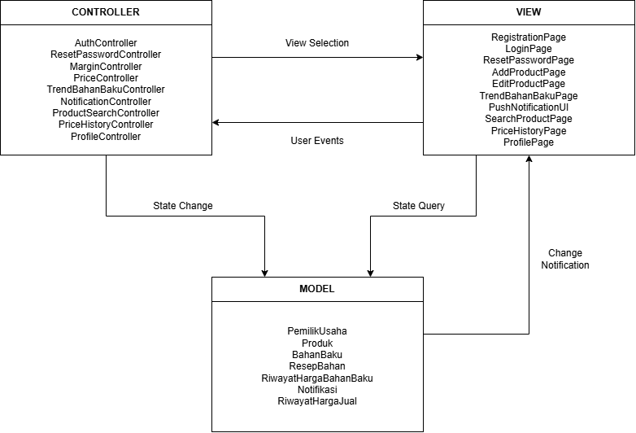
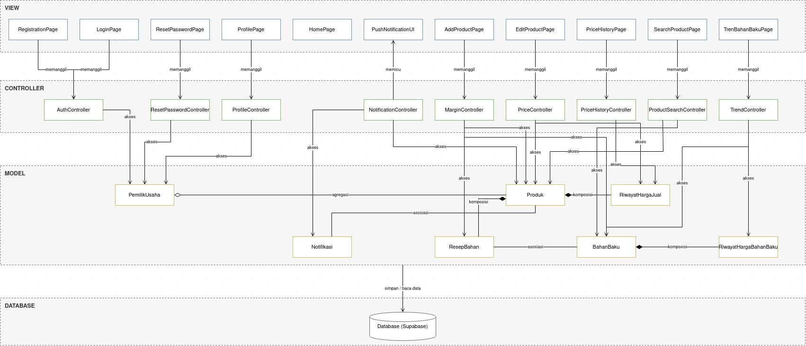
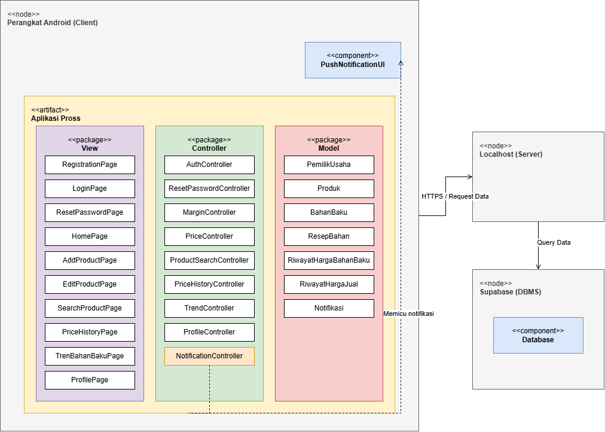

<h1>
IF2150 REKAYASA PERANGKAT LUNAK
 
TUGAS 6
 
ARSITEKTUR PERANGKAT LUNAK (APL)
</h1>
 

## *Pross*

### Untuk: *Stefani Angeline Oroh*

Dipersiapkan oleh:
| Informasi | Keterangan |
| --- | --- |
| Kelas | *K02* |
| Kelompok | *G07* |

| NIM | Nama |
| --- | --- |
| *13525002* | *Ahmad Boutros Fathir* |
| *13525020* | *Klio Lysander* |
| *13525047* | *Muhammad Fakhriyan Rizki M.* |
| *13525053* | *Kevin Sie* |
| *13525056* | *Mochammad Nuha Al Ghifari* |
| *13525062* | *Rafel Dzinun Muhammad* |

---

 
 

# BAB 1: Style/Pattern Arsitektur Acuan
Pattern arsitektur yang dipilih untuk perangkat lunak Pross adalah MVC. Pada pattern ini, model bertanggung jawab dalam merepresentasikan dan mengelola data utama sistem. View bertanggung jawab menampilkan antarmuka kepada pengguna atau meneruskan aksi pengguna ke Controller. Controller berguna untuk memproses logika bisnis, memvalidasi input dan memperbarui model berdasarkan permintaan dari view. 

Pemilihan MVC didasarkan karena karakteristik yang akan dibuat pada perangkat lunak Pross yaitu:
1. Satu objek pada Model yang sama akan dipakai bersama oleh beberapa View berbeda. Contoh: Pada data Produk diakses oleh AddProductPage saat sebuah produk dibuat, EditProductPage saat harga jual diubah, atau SearchProductpage saat produk suatu produk dicari
2. Alur proses bisnis perangkat lunak Pross hampir selalu dimulai dari input, proses, dan menampilkan yang berulang dari beberapa fitur, sehingga pemisahan tanggung jawab memudahkan untuk mengembangkan tiap fitur.
3. Perangkat lunak Pross hanya memiliki satu jenis pengguna sehingga kebutuhan antarmuka dapat relatif seragam.

<i>Gambar 1. Contoh Arsitektur MVC</i>

Tabel 1.1. Lingkungan Operasi Perangkat Lunak

| Komponen | Spesifikasi |
| :--- | :--- |
| *Server* | *Localhost untuk keperluan pengujian dan pengembangan* |
| *Client* | *Aplikasi mobile* |
| *DBMS* | *Supabase* |
| *OS* | *Android* |

---

# BAB 2: Identifikasi Komponen / Modul / Subsistem

Tabel 2.1. Identifikasi Komponen/Modul/Subsistem

| Nama Komponen/Modul/Subsistem | Jenis | Penjelasan |
| :--- | :--- | :--- |
| *RegistrationPage* | *View* | *Menampilkan form untuk registrasi akun yang berisi username, email, serta password, setelah input akan diteruskan menuju AuthController.* |
| *LoginPage* | *View* | *Menampilkan form untuk memasuki aplikasi menggunakan akun yang telah dibuat lalu memverifikasinya menuju AuthController, menyediakan opsi untuk mengubah password jika melupakannya.* |
| *ResetPasswordPage* | *View* | *Menampilkan form untuk reset password lalu diteruskan menuju ResetPasswordController.* | 
| *HomePage* | *View* | *Menampilkan halaman utama dari aplikasi dengan menunjukan beberapa menu seperti menambahkan product dan searching.* | 
| *AddProductPage* | *View* | *Menampilkan halaman yang berisi form untuk menambahkan product yang nanti akan diteruskan menuju MarginController untuk dihitung Margin penjualannya.* |
| *EditProductPage* | *View* | *Menampilkan halaman yang berisi detail produk yang dapat pengguna ubah sesuai dengan keinginan lalu akan diteruskan menuju PriceController jika pengguna mengubah nilai harga jual dan disimpan pada RiwayatHargaJual.* |
| *SearchProductPage* | *View* | *Menampilkan halaman setelah pengguna mencari sebuah barang atau mencari berdasarkan tag dan bahan baku.* |
| *PriceHistoryPage* | *View* | *Menampilkan riwayat harga jual dari sebuah produk.* |
| *TrenBahanBakuPage* | *View* | *Menampilkan daftar bahan baku, filter rentang waktu, dan memvisualisasikan grafik tren riwayat harga bahan baku.* |
| *PushNotificationUI* | *View* | *Menampilkan antarmuka notifikasi bawaan sistem operasi (OS) yang muncul di perangkat pengguna sebagai peringatan kerugian.* |
| *ProfilePage* | *View* | *Menampilkan halaman yang berisi data akun dari pengguna serta tombol "logout" untuk keluar dari akun.* |
| *AuthController* | *Controller* | *Memproses logika verifikasi kredensial login, memvalidasi input form registrasi, dan mengelola sesi autentikasi pengguna.* |
| *ResetPasswordController* | *Controller* | *Memvalidasi input password baru yang memenuhi standar dan memperbaruinya di dalam database.* |
| *MarginController* | *Controller* | *Memvalidasi input produk baru, memproses kalkulasi margin awal, serta menyimpan data entitas produk dan resep ke database.* |
| *PriceController* | *Controller* | *Memvalidasi input perubahan harga jual, memperbarui harga pada produk, dan memicu pencatatan ke dalam riwayat harga.* |
| *ProductSearchController* | *Controller* | *Memproses kata kunci yang diinput dan melakukan pencocokan (filtering) terhadap data produk untuk menghasilkan daftar yang relevan.* |
| *PriceHistoryController* | *Controller* | *Mengambil data riwayat harga jual dari database, menerapkan filter waktu, dan menyusunnya menjadi format grafik yang bisa ditampilkan.* |
| *NotificationController* | *Controller* | *Mendeteksi hasil kalkulasi margin negatif setelah pembaruan harga beli, membuat objek notifikasi, dan memicu pengiriman pesan.* |
| *TrendController* | *Controller* | *Mengambil data riwayat harga bahan baku dari database, menerapkan filter waktu, dan mengonversinya menjadi format grafik tren.* |
| *ProfileController* | *Controller* | *Memvalidasi dan menyimpan perubahan data akun pengguna ke database, serta menangani proses pengakhiran sesi saat logout.* |
| *PemilikUsaha* | *Model* | *Menyimpan dan merepresentasikan data atribut profil pengguna (nama usaha, email, no telepon, dan password).* |
| *Produk* | *Model* | *Menyimpan data entitas operasional produk yang dikelola, meliputi nama, tag, harga jual, margin, dan status peringatan aktif.* |
| *BahanBaku* | *Model* | *Menyimpan data referensi entitas bahan baku pasar beserta nominal harga belinya.* |
| *ResepBahan* | *Model* | *Menyimpan relasi takaran spesifik dari bahan baku yang digunakan dalam komposisi resep suatu produk.* |
| *RiwayatHargaBahanBaku* | *Model* | *Menyimpan entitas catatan historis fluktuasi harga beli bahan baku beserta stempel waktu (timestamp) perubahannya.* |
| *RiwayatHargaJual* | *Model* | *Menyimpan entitas catatan historis perubahan harga jual suatu produk sebelum dan sesudah diperbarui beserta waktu perubahannya.* |
| *Notifikasi* | *Model* | *Menyimpan detail entitas pesan peringatan sistem, waktu pengiriman, dan status keterbacaan (read/unread).* |
| *Database* | *Penyimpanan Data* | *Menyimpan seluruh data model secara persisten, baik secara lokal maupun terpusat dengan menggunakan Supabase.* |

---

# BAB 3: Model Arsitektur Perangkat Lunak

## 3.1 Logical View

Logical View dipilih untuk menggambarkan struktur logis perangkat lunak Pross, yaitu bagaimana komponen pada Tabel 2.1 dikelompokkan menurut pattern MVC dan saling berhubungan. Sudut pandang ini cocok untuk Pross karena aplikasi ini dirancang dengan pemisahan handling yang jelas. Ada *View* yang menampilkan antarmuka dan meneruskan aksi pengguna, ada *Controller* memproses validasi input, kalkulasi margin, pencatatan riwayat harga, dan pemicu notifikasi, lalu *Model* merepresentasikan data utama. Dengan pemisahan ini, satu *Model* seperti *Produk* dapat diakses oleh beberapa *Controller* tanpa menduplikasi logika, dan perubahan pada satu fitur tidak perlu mengubah fitur lain.

<i>Gambar 2. Logical View pada Pross</i>

## 3.2 Physical View

Physical View dipilih untuk memetakan bagaimana perangkat lunak Pross didistribusikan secara fisik ke dalam infrastruktur perangkat keras dan lingkungan eksekusi. View ini berfokus untuk menunjukkan di mana setiap bagian dari sistem dijalankan, sehingga mempermudah pemahaman mengenai topologi jaringan, lingkungan operasi, dan interaksi fisik antar-node penyusun sistem tanpa mengulang alur logika pemanggilan antar-komponen.

<i>Gambar 3. Physical View pada P/L Pross</i>

Gambar 3 merupakan diagram Physical View yang menunjukkan infrastruktur lingkungan operasi dari perangkat lunak Pross. Terdapat tiga node utama yang menyusun sistem ini. Node pertama adalah Perangkat Android bertindak sebagai Client yang menjalankan lingkungan eksekusi operasi sistem Android. Di dalam node ini, terdapat artefak Aplikasi Pross yang mewadahi pengelompokan komponen View, Controller, dan Model, serta komponen PushNotificationUI yang terpisah karena berjalan sebagai notifikasi bawaan sistem operasi. Node kedua adalah Localhost yang berperan sebagai Server untuk menangani lalu lintas data selama fase pengujian dan pengembangan. Node ketiga adalah infrastruktur Supabase yang berfungsi sebagai DBMS tempat komponen Database beroperasi secara persisten. Setiap node terhubung melalui jalur komunikasi jaringan yang diberi label sesuai dengan protokol atau aksi yang dilakukan, seperti permintaan data (API request) dan eksekusi query.

---

# Referensi

- Sommerville, I. (2016). *Software Engineering* (10th ed.). Pearson. Chapter 6: *Architectural Design*: [https://software-engineering-book.com/slides/](https://software-engineering-book.com/slides/)
- Diagram arsitektur: [https://www.drawio.com/](https://www.drawio.com/), [https://staruml.io/](https://staruml.io/)
