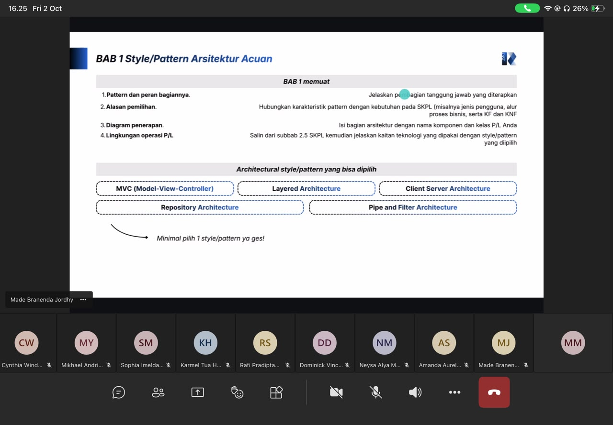

# Form Asistensi

## Tugas Besar IF2150 - Rekayasa Perangkat Lunak

| Informasi | Keterangan |
| --- | --- |
| **Hari** | *Jumat* |
| **Tanggal** | *02/10/2026* |
| **Kelas** | *K02* |
| **Nomor Kelompok** | *G07*  |
| **Nama Kelompok** | *Repeel*  |
| **Nama Perangkat Lunak** | *Pross*  |
| **Dokumen** | *Arsitektur Perangkat Lunak*  |

### Anggota Kelompok

| NIM | Nama |
| --- | --- |
| *13525002* | *Ahmad Boutros Fathir* |
| *13525020* | *Klio Lysander* |
| *13525047* | *Muhammad Fakhriyan Rizki M.* |
| *13525053* | *Kevin Sie* |
| *13525056* | *Mochammad Nuha Al Ghifari* |
| *13525062* | *Rafel Dzinun Muhammad* |

### Catatan

| Catatan |
| --- |
| 1. *Menggunakan SKPL sebagai baseline final, ketiga bab menjelaskan rancangan sistem yang sama secara konsisten*  |
| 2. *Wajib memilih minimal satu style/pattern arsitektur dan menjelaskan serta menyertakan alasannya berdasarkan KF dan KNF* |
| 3. *Semua Use case harus dapat dijelaskan sesuai dengan SKPL dari milestone sebelumnya* |
| 4. *Minimal bikin 1 view arsitektur sesuai atau mirip dengan contoh* |

**Notes for this section:**  
*Catatan dapat dituliskan dalam bentuk paragraf atau poin-poin, disesuaikan saja.* 

## Dokumentasi

<!--  -->

  

  <i>Gambar 1. Dokumentasi kegiatan asistensi.</i>

